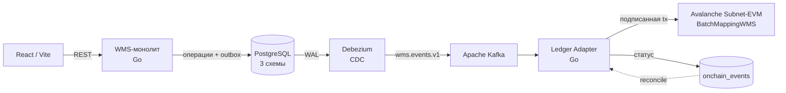

# WMS + Blockchain

> Система управления складом (WMS) с **неизменяемой аудит-полосой операций на блокчейне**. Каждая физическая операция на складе фиксируется в смарт-контракте через паттерн **Outbox + CDC** — без двойной записи в приложении и без потери событий.

Off-chain — обычная реляционная система (PostgreSQL, бизнес-логика на Go). On-chain — детерминированный конечный автомат, который верифицирует, что товар прошёл этапы в правильном порядке. Связаны они однонаправленным потоком через CDC, так что блокчейн нельзя «обойти» из приложения.

**Стек:** Go · PostgreSQL 17 · Debezium (CDC) · Apache Kafka · Avalanche Subnet-EVM · Solidity · React 19 / Vite · Docker Compose

---

## Что это за система

WMS управляет 5 этапами жизненного цикла товара:

**Приёмка на КПП → Приёмка на столе → Раскладка → Сборка → Отгрузка**

Каждая значимая операция автоматически попадает в смарт-контракт `BatchMappingWMS`, реализующий FSM `None → Accepted → PutAway → Picked → Shipped`. Контракт — **верификатор, а не хранилище**: он подтверждает корректность переходов, а не дублирует данные склада.

### Архитектура потока данных



Ключевая идея: **WMS пишет только в PostgreSQL** (включая `outbox_events`). Debezium читает WAL и публикует события в Kafka. Ledger Adapter их потребляет, батчит и отправляет в блокчейн. Нет распределённой транзакции — есть надёжный однонаправленный конвейер с идемпотентностью на каждом стыке.

---

## Результаты

Это исследовательско-проектная работа; ключевые измеримые результаты (полные отчёты — в [`docs/load-testing/`](docs/load-testing/)):

| Направление | Результат |
|-------------|-----------|
| **Сквозная пропускная способность (локально)** | Устойчиво **~1 900 зафиксированных переходов состояния/с** end-to-end (WMS → БД → Kafka → чейн), при целевом требовании 1 500 TPS; **0 потерянных** событий на дренаже 150k. Разбор: [`stress-load-tests-full-report.md`](docs/load-testing/stress-load-tests-full-report.md) |
| **Гео-распределённая сеть** | Сеть валидаторов в нескольких странах под **реальным BFT-консенсусом**; **переживает отказ одной ноды** (kill-1 проверен), 0 потерянных событий на полном дренаже. Отчёт: [`geo-distributed-report.md`](docs/load-testing/geo-distributed-report.md) |
| **Анализ узких мест гео** | Пропускная способность по WAN ниже локальной — и это **цена консенсуса, а не предел протокола**; основное замедление оказалось чинимым конфигом кэшей, а не «чистым железом». Разбор: [`geo-throughput-rootcause.md`](docs/load-testing/geo-throughput-rootcause.md) |
| **Надёжность** | Трёхслойная идемпотентность (БД → приложение → контракт) + reconcile-loop; at-least-once доставка Kafka сводится к effectively-once на стороне блокчейна |

---

## Структура проекта

```
blockchain_project/
├── wms/                      # WMS-сервис (модульный монолит, Go)
│   ├── cmd/wms/              #   точка входа
│   ├── internal/
│   │   ├── domain/           #   доменные модели
│   │   ├── receiving/        #   модуль: приёмка (КПП + стол)
│   │   ├── putaway/          #   модуль: раскладка
│   │   ├── assembly/         #   модуль: сборка
│   │   ├── shipping/         #   модуль: отгрузка
│   │   ├── ledger/           #   HTTP-клиент к ledger-adapter
│   │   └── platform/         #   инфраструктура (postgres, kafka, http)
│   └── migrations/           #   SQL-миграции
│
├── ledger-adapter/           # мост в блокчейн (Go)
│   ├── cmd/adapter/          #   точка входа
│   ├── internal/             #   consumer, batch-flusher, reconcile, idempotency
│   └── contracts/            #   BatchMappingWMS.sol (+ Foundry-тесты)
│
├── frontend/                 # веб-клиент (React 19, Vite, TypeScript, Zustand)
│
├── deploy/
│   ├── subnet/               # локальный воспроизводимый Subnet-EVM (dev-чейн)
│   ├── geo/                  # гео-распределённая сеть валидаторов + бенчмарки
│   ├── debezium/             # CDC-коннекторы
│   ├── jmx/                  # JMX-экспортёры
│   ├── db-init.sh · seed.sql # инициализация БД
│   └── kafka-init.sh
│
├── tests/
│   ├── e2e/                  # сквозной тест: WMS → БД → Kafka → чейн
│   └── stress/               # нагрузочные сценарии k6 + тюнинг
│
├── docs/                     # документация (см. docs/index.md — точка входа)
├── ci/                       # CI-пайплайны (lint / test / build)
├── docker-compose.yaml       # весь локальный стек одной командой
└── Makefile                  # команды разработки
```

---

## Быстрый старт

### Требования

- [Docker](https://docs.docker.com/get-docker/) и Docker Compose
- [Go 1.24+](https://go.dev/dl/) — для локальной разработки и тестов
- [Node.js 20+](https://nodejs.org/) — для фронтенда
- (опц.) [pre-commit](https://pre-commit.com/#install), [golangci-lint](https://golangci-lint.run/) — для разработки

### Запуск всего стека

```bash
# 1. Переменные окружения
cp .env.example .env
#    обязательно задать уникальный JWT_SECRET, например:
#    openssl rand -hex 32

# 2. Поднять всё (включая локальную Subnet-EVM-ноду — она стартует,
#    инициализируется и разворачивает контракт автоматически)
make up

# 3. Инициализировать БД (миграции + seed) и топики Kafka
make init

# 4. Зарегистрировать Debezium-коннектор (запускает CDC-конвейер)
make register-connector

# 5. Проверить статус
make ps
```

### Фронтенд

```bash
cd frontend
npm install
npm run dev        # Vite dev-сервер на http://localhost:5173
```

### Сервисы

| Сервис | URL | Описание |
|--------|-----|----------|
| Frontend (Vite) | http://localhost:5173 | Веб-клиент склада |
| WMS Service | http://localhost:8081 | Основной WMS API |
| Ledger Adapter | http://localhost:8085 | Блокчейн-мост |
| Debezium Connect | http://localhost:8083 | Управление CDC-коннекторами |
| Kafka UI | http://localhost:8080 | Просмотр топиков |
| Grafana | http://localhost:3000 | Дашборды мониторинга |
| Prometheus | http://localhost:9090 | Метрики |

---

## Тесты

```bash
make lint                 # golangci-lint по wms + ledger-adapter
make test                 # юнит-тесты Go (с -race) по обоим сервисам
make e2e-test-outbound    # сквозной e2e: WMS API → БД → Kafka → чейн
make stress               # нагрузочные сценарии k6 (в Docker)

cd ledger-adapter/contracts && forge test   # тесты смарт-контракта (Foundry)
```

---

## Гео-распределённая сеть

Помимо локального dev-чейна (`deploy/subnet/`), проект поднимает **настоящую гео-распределённую сеть валидаторов** в нескольких странах под BFT-консенсусом — для проверки отказоустойчивости и поведения под нагрузкой по WAN. Бенчмарк-харнес, метрики и сценарий отказа ноды живут в [`deploy/geo/`](deploy/geo/README.md).

Главный вывод: сеть **финализирует блоки и переживает потерю валидатора без потери событий**, а сниженная по сравнению с локальной пропускная способность — это плата за географический консенсус, а не предел технологии (подробный разбор: [`geo-throughput-rootcause.md`](docs/load-testing/geo-throughput-rootcause.md)).

---

## Документация

Репозиторий подробно задокументирован. Полный индекс — в **[`docs/index.md`](docs/index.md)**; ниже — карта по разделам.

### Старт и архитектура
| Документ | О чём |
|----------|-------|
| [Индекс документации](docs/index.md) | Полная навигация по всем докам |
| [Developer README](docs/developer/README.md) | **Точка входа для приёма проекта:** обзор, стек, маршрут чтения, глоссарий |
| [Архитектура системы](docs/architecture/system-overview.md) | Компоненты, роли, Kafka/Debezium, безопасность |
| [Конвенции проекта](docs/CONVENTIONS.md) | Git workflow, Go style, SQL naming, Docker |

### Бизнес-процесс и потоки
| Документ | О чём |
|----------|-------|
| [Сквозной путь товара](docs/business-process/end-to-end-flow.md) | Полный жизненный цикл глазами оператора |
| [Диаграммы потоков данных (DFD)](docs/business-process/data-flow-diagrams.md) | Level 0 (контекст) → 1 (процессы) → 2 (по модулям) |
| Flow по этапам | [КПП](docs/flows/receiving-gate-flow.md) · [Стол приёмки](docs/flows/receiving-table-flow.md) · [Раскладка](docs/flows/putaway-flow.md) · [Сборка](docs/flows/assembly-flow.md) · [Отгрузка](docs/flows/shipping-flow.md) |

### Модель данных
| Документ | О чём |
|----------|-------|
| [Жизненные циклы сущностей](docs/data-model/entity-lifecycle.md) | Все статусы, все переходы, все сущности |
| [ER-диаграмма](docs/data-model/er-diagram.md) | Связи таблиц, уникальные ограничения |
| [Схема БД (подробно)](docs/db/Database_ru_v2.md) | Все поля всех таблиц (3 схемы) |

### API
| Документ | О чём |
|----------|-------|
| [OpenAPI-спецификация](docs/api/openapi.yaml) | Машиночитаемый контракт — **источник истины** |
| [API-контракт](docs/api/api-contract.md) | Request/response, ошибки, побочные эффекты |
| [Swagger UI](docs/api/swagger-ui.html) | Интерактивный просмотр спецификации |

### Интеграция WMS ↔ блокчейн
| Документ | О чём |
|----------|-------|
| [Маппинг WMS → блокчейн](docs/integration/blockchain-mapping.md) | Какая операция что пишет на чейн, полный путь события |
| [Контракт данных](docs/integration/data-contract.md) | Формат outbox → Kafka → adapter → onchain_events |
| [BatchMappingWMS](docs/integration/batch-mapping-approach.md) | Смарт-контракт: FSM, batch-функции, производительность |

### Референсы разработчика (hand-off)
| Документ | О чём |
|----------|-------|
| [WMS Reference](docs/developer/wms-reference.md) | Пакеты, модули, сервисы, репозитории, запись outbox |
| [Ledger Adapter Reference](docs/developer/ledger-adapter-reference.md) | Consumer, batch-flusher, reconcile, идемпотентность |
| [Smart Contract Reference](docs/developer/smart-contract-reference.md) | FSM, сигнатуры, события, storage layout, UUID→uint256 |
| [Operations](docs/developer/operations.md) | Эксплуатация: compose, env, init БД/Kafka, Debezium, мониторинг |

### Производительность, нагрузка, гео
| Документ | О чём |
|----------|-------|
| [Нагрузочный отчёт (цель 1500 TPS)](docs/load-testing/stress-load-tests-full-report.md) | Полный разбор: ~1900 переходов/с, 0 потерь |
| [Гео-распределённый отчёт](docs/load-testing/geo-distributed-report.md) | Сеть валидаторов, отказоустойчивость, kill-1 |
| [Разбор узких мест гео](docs/load-testing/geo-throughput-rootcause.md) | Почему WAN-пропускная ниже и где реальный предел |
| [Performance Journey](docs/load-testing/performance-journey.html) | Интерактивный рассказ о пути оптимизации |
| [N9 flaky root-cause](docs/load-testing/n9-flaky-rootcause-analysis.md) | Разбор нестабильного e2e-теста |

### Исследование предметной области
| Документ | О чём |
|----------|-------|
| [Blockchain в WMS — обзор](docs/blockchain-wms-research/index.html) | Академический и рыночный обзор (теоретическая база) |

### Деплой
| Документ | О чём |
|----------|-------|
| [Локальный Subnet-EVM](deploy/subnet/README.md) | Воспроизводимый dev-чейн |
| [Гео-сеть валидаторов](deploy/geo/README.md) | Многонодовая гео-сеть + бенчмарки |

---

## Для разработчиков

### Паттерн модуля

Каждый бизнес-модуль (`receiving`, `putaway`, `assembly`, `shipping`) имеет одинаковую структуру:

```
internal/receiving/
├── handler.go      # HTTP-обработчики (принимает запрос, вызывает service)
├── service.go      # бизнес-логика (валидация, оркестрация)
└── repository.go   # работа с БД (SQL-запросы)
```

**Правило зависимостей:** `handler → service → repository`. Никогда не наоборот.

Подробнее — [`wms/README.md`](wms/README.md) и [`ledger-adapter/README.md`](ledger-adapter/README.md).

### Code style

- **Линтер:** golangci-lint ([`.golangci.yml`](.golangci.yml))
- **Форматирование:** `gofmt` + `goimports` (через pre-commit — `make hooks-install`)
- **Коммиты:** Conventional Commits ([`docs/CONVENTIONS.md`](docs/CONVENTIONS.md))

## Переменные окружения

Полный список — в [`.env.example`](.env.example).

| Переменная | Описание | По умолчанию |
|------------|----------|--------------|
| `DB_USER` / `DB_PASSWORD` / `DB_NAME` | Доступ к PostgreSQL | `root` / `root` / `wms_blockchain_db` |
| `JWT_SECRET` | Секрет подписи JWT (задать вручную, ≥32 символа) | — |
| `RPC_URL` | RPC EVM-чейна (Avalanche Subnet-EVM или любой EVM-совместимый) | `http://localhost:8545` |
| `PRIVATE_KEY` | Приватный ключ для подписи транзакций адаптером | — |
| `CONTRACT_ADDR` | Адрес развёрнутого `BatchMappingWMS` | — |

## Лицензия

Проект распространяется под лицензией **GNU General Public License v3.0** — полный текст в [`LICENSE`](LICENSE).

Copyright (C) 2026 Леонид Ложкин и контрибьюторы (полный список — в истории git и разделе Contributors на GitHub).
