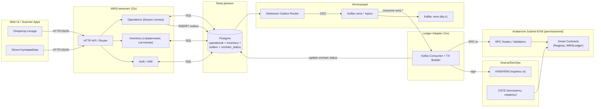
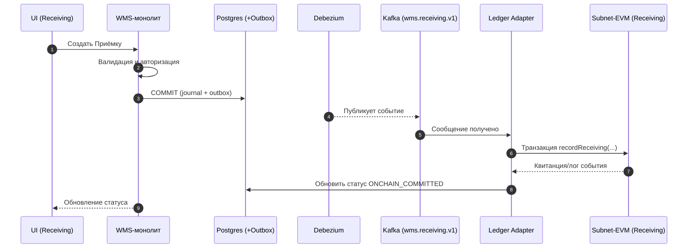

**Версия:** 0.4 (для прототипа)
**Цель документа:** объяснить «что, зачем и как» — без глубоких знаний блокчейна, с фокусом на проверке логики WMS и он‑чейн аудита.

> [!SUMMARY] Если в двух словах
> Мы строим WMS‑монолит на Go и Postgres, а блокчейн используем как «ленту кассовых чеков» — неизменяемую, независимую от БД запись ключевых этапов (Приёмка → Раскладка → Сборка → Отгрузка).
> Это даёт сильную аудит‑полосу и простую проверку подлинности действий задним числом. Вся «тяжёлая» бизнес‑логика и данные остаются в WMS и БД, на блокчейне — только минимум: ссылки/хэши, актор, время и финальный «срез» состояния.

---

## Контекст и цели

- **Что строим:** прототип WMS, который фиксирует 4 ключевых этапа жизненного цикла складской единицы: **Приёмка**, **Раскладка**, **Сборка**, **Отгрузка**.
- **Зачем блокчейн:** получить **неизменяемую аудит‑полосу** этих этапов, независимую от нашей БД и админских прав.
- **Почему не всё на блокчейне:** это дорого и медленно для «тяжёлых» данных; нам нужны скорость и SQL для операций и отчётов. Поэтому — минимум on‑chain, максимум off‑chain.
- **Что именно проверяем в MVP:** что наша логика WMS и интеграция с блокчейном через Kafka/Debezium **работают надёжно**, без потерь и дубликатов, и что «квитанции» появляются на блокчейне автоматически.

---

## Глоссарий простыми словами

- **Kafka** — «автобус событий» между WMS и Ledger Adapter: WMS положил сообщение, адаптер забрал. Есть порядок внутри ключа и высокая производительность.
- **Топик** — «канал» в Kafka. Пример: `wms.receiving.v1` — все события про Приёмку (версия 1).
- **Debezium** — «слушатель изменений в БД». Мы используем его, чтобы **автоматически** публиковать события в Kafka из нашей таблицы «аутбокс» (см. ниже).
- **Outbox (аутбокс)** — таблица в БД, куда WMS кладёт «событие» **в одной транзакции** с бизнес‑записью. Debezium подхватывает и публикует в Kafka.
- **Blockchain / Avalanche Subnet‑EVM** — отдельная сеть (наша), совместимая с Ethereum. Мы используем её как **неизменяемый журнал** «кто‑что‑когда сделал».
- **Идемпотентность** — «не навреди при повторе»: одно и то же событие при повторной обработке не создаёт дубликатов.

---

## Общий обзор архитектуры

### Логическая схема компонентов

**Ключевая идея:** WMS-монолит работает «как обычно» (Go + Postgres). Каждая операция порождает запись в БД **и** событие в Outbox — в одной транзакции. Debezium публикует его в Kafka. Отдельный Ledger Adapter забирает это событие, формирует транзакцию и отправляет её в наш сабнет Avalanche. Когда сеть подтверждает событие, адаптер обновляет статус в БД.

---

## **Как это работает за 5 минут**

1. Пользователь в UI выполняет шаг (например, **Приёмка**).
2. WMS применяет бизнес‑правила и **коммитит в Postgres** (журнал операции + запись в **Outbox**) **одной транзакцией**.
3. Debezium «увидит» новую запись в Outbox и **опубликует** событие в Kafka‑топик wms.receiving.v1.
4. Ledger Adapter забирает событие из Kafka и отправляет **он‑чейн транзакцию** в наш сабнет (метод смарт‑контракта «recordReceiving»).
5. Сеть подтверждает транзакцию, адаптер **обновляет статус** записи в БД на «ONCHAIN_COMMITTED».
6. UI/отчёты видят и **быстрый локальный коммит** в БД, и **подтверждение блокчейна**.

---

## **Компоненты системы: роли и обязанности**

> [!TIP] Принцип разделения

> Система состоит из двух приложений: **WMS-монолит** (вся бизнес-логика, API, справочники, аутентификация) и **Ledger Adapter** (мост в блокчейн). Общение между ними — через Kafka (асинхронные события). Оба работают с одной БД Postgres.

### **1) WMS-монолит (Go)**
- **Зачем:** единое приложение, объединяющее HTTP API, бизнес-логику 4 этапов, справочники и аутентификацию.
- **Модули внутри:**
  - **HTTP API / Router** — точка входа для UI, маршрутизация, троттлинг.
  - **Auth / IAM** — пользователи, роли, привязка к EVM-адресам (для он-чейн ролей). В MVP — один пользователь.
  - **Operations** — бизнес-процессы 4 этапов (Приёмка, Раскладка, Сборка, Отгрузка). Хранит журналы операций (receivings, putaways, pickings, shipments), статусы сущностей (HU/Order/Shipment). Write-heavy модуль.
  - **Inventory** — справочники номенклатуры, складских ячеек (bin), HU (handling unit). Read-heavy модуль для отображения текущего состояния.
- **Kafka/Outbox:** при коммите каждой операции создаёт событие в Outbox; Debezium публикует в соответствующий топик.
- **Ошибки:** если он-чейн подтверждение задерживается — запись остаётся в статусе «PENDING_ONCHAIN», UI показывает «ожидание сети».

> [!NOTE] Модули внутри монолита разделены на пакеты (packages) с чёткими границами. При необходимости любой модуль можно вынести в отдельный сервис — интерфейсы и контракты уже определены.

### **2) Ledger Adapter (Go)**

- **Зачем:** **единственная точка** взаимодействия WMS с блокчейном.
- **Функции:**
    - Подписка на топики Kafka: wms.receiving.v1, wms.putaway.v1, wms.picking.v1, wms.shipping.v1.
    - Построение и отправка транзакций в Subnet‑EVM; повторы с бэкоффом при сбоях.
    - Идемпотентность: собственная таблица onchain_events(event_id, tx_hash, status), чтобы одно событие не ушло дважды.
    - Обратный канал: слушает он‑чейн события по адресам контрактов и **обновляет статусы** записей в Postgres.

---

## **Kafka: зачем, какие топики и как мы их используем**

> [!INFO] Почему Kafka

> Она даёт масштабируемую, отказоустойчивую доставку событий «хотя бы один раз» с гарантией порядка **внутри ключа**. Это идеально для наших HU/Order — мы ключуем по ним и сохраняем корректный порядок этапов.

> [!NOTE] Предлагаю оставлять ключи партиционирования, на данном этапе их выгода не настолько очевидна, но при росте функционала и разного рода операций позволит быть уверенным в том, что запись события по конкретному ключу попадет в одну и ту же партицию. Безопаснее и чище получается. При round-robin могут возникнуть ошибки порядка обработки (теоретически).

### **Топики (MVP)**

|**Топик**|**Назначение**|**Ключ партиционирования**|**Потребители**|**SLA доставки**|
|---|---|---|---|---|
|wms.receiving.v1|События Приёмки|huId или asnId|Ledger Adapter|< 1 сек до адаптера|
|wms.putaway.v1|События Раскладки|huId или binId|Ledger Adapter|< 1 сек|
|wms.picking.v1|События Сборки|orderId|Ledger Adapter|< 1 сек|
|wms.shipping.v1|События Отгрузки|shipmentId|Ledger Adapter|< 1 сек|
|wms.dlq.v1|«Плохие» сообщения (Dead Letter Queue)|оригинальный ключ|Техподдержка/алерты|asap|

**Параметры (рекомендации для MVP):**
- Разделы (partitions): формула оценки: минимально нужно партиций = **max(требуемый throughput / throughput одной партиции для продюсера, требуемый throughput / throughput одной партиции для консюмера)**. Предлагаю взять 2-3 на консьюмер.
- Репликация: 3.
- Retention: 7–14 дней (оперативная диагностика). Исторический след хранится в БД и на блокчейне.
- Продьюсеры: acks=all, идемпотентность включена.
> [!NOTE] acks = all позволяет нам быть уверенным, что сообщение запишется хотя бы на несколько брокеров. Мы ждем подтверждение от всех синхронных реплик. Медленнее, но надежнее. При неудовлетворительной производительности вернуться к acks = 1, получать подтверждение только от лидера партиции. Но если лидер упадет до репликации, сообщение может быть утеряно.

---
## **Debezium и паттерн Outbox: без потерь и дубликатов**

> [!TIP] Идея в одном абзаце

> Вместо того чтобы WMS пытался и в БД записать, и в Kafka отправить (две системы, риск несогласованности), он пишет **только в БД** двумя INSERT'ами в одной транзакции: бизнес‑запись + запись в outbox_events. Debezium «снимает» outbox и публикует в Kafka. Так мы исключаем «двойную запись» и потери.

**Как это выглядит:**
- Таблица outbox_events: поля «тип агрегата», «идентификатор», «тип события», «payload/минимальные поля», «created_at».
- Debezium Outbox Router настроен на публикацию в соответствующий Kafka‑топик по полю event_type.
- Повторы и сбои:
    - Если Debezium/ Kafka временно недоступны — запись уже в БД и никуда не пропадёт.
    - Если одно событие будет прочитано дважды — Ledger Adapter снимет дубликат за счёт event_id.
---
## **Блокчейн‑слой: Avalanche Subnet‑EVM в двух частях**

> [!NOTE] Почему именно Avalanche Subnet‑EVM

- > **Совместимость с EVM**: используем знакомые инструменты и понятные контракты.
- > **Собственная сеть (permissioned)**: контролируем, кто может отправлять транзакции и деплоить контракты; предсказуемые комиссии.
- > **Быстрая финальность**: пиковые задержки малы, нам достаточно секунд.
### **Что мы пишем на блокчейн**

Только то, что необходимо для **аудита и проверки**:
- **Идентификатор события** (eventId) — уникальный ключ идемпотентности.
- **Объект и стадия** (например, huId и «RECEIVED»).
- **Кто и когда** (адрес отправителя/актора, метка времени).
- **Ссылки/хэши** на полные данные, которые хранятся в нашей БД/файловом хранилище.

> [!NOTE] Предлагаю приводить payload к каноническому JSON, считать от него хэш и писать в блокчейн. Таким образом, при автоматическом аудите мы сможем быть точно уверены, что запись в блокчейне соответствует строчке в pg.
### **Права и ограничения (permissioned‑сабнет)**

- **Transaction Allow List** — только разрешённые адреса (например, сервисный адрес Ledger Adapter) могут отправлять транзакции.
- **Contract Deployer Allow List** — только доверенный CI/адрес может деплоить/обновлять контракты.
- **Fee Manager** — настраиваем комиссии и лимиты так, чтобы подтверждения были быстрыми и недорогими.

> [!WARNING] Мы **не** храним полную историю в состоянии контрактов — это дорого. История доступна через **события (логи)** блокчейна, а в storage — только «последний срез» по HU/Order/Shipment.

---

## **Взаимодействие с блокчейном: последовательности событий**

### **Пример: «Приёмка»**

Аналогично работают **Раскладка**, **Сборка**, **Отгрузка** — меняются только названия событий и поля.

---

## **Аудит: что попадает на блокчейн и как это проверять**

> [!IMPORTANT] Зачем аудит

> Чтобы любой участник (или внешний аудитор) мог убедиться: конкретный HU/заказ прошёл этапы **в этом порядке**, **в это время**, **этим актором**, а данные, на которые мы ссылаемся, не были подменены.

**Как проверяем:**

1. Ищем по он‑чейн логам события по huId/orderId (фильтр по индексированным полям).
2. Сверяем последовательность стадий и временные метки.
3. Сверяем metaHash/docHash с расчётом хэша от наших off‑chain данных (если нужно убедиться в неизменности содержимого документа).

**Кто может отправлять транзакции:** только адреса из allow‑list (Ledger Adapter и доверенные операторы), что исключает «левые» записи.

---

## **Данные и БД (высокоуровнево)**

Вся система работает с **одной базой Postgres**. WMS-монолит и Ledger Adapter обращаются к одной БД, что упрощает инфраструктуру и транзакционную согласованность.

**Операционные таблицы (примерный состав):**
- receivings, putaways, pickings, shipments — журналы шагов; индексация по ключевым полям, партиционирование по дате (для масштабируемой очистки и быстрых запросов).
- handling_units, orders, shipments_header — справочники и «последний срез» статусов.
- items, bins — номенклатура и складские ячейки.
- outbox_events — общая таблица для событий, которые нужны в Kafka.
- onchain_events — учёт он‑чейн отправок и статусов (идемпотентность адаптера).

> [!NOTE] Почему партиционирование

> История будет расти — партиции позволяют быстро архивировать старые данные и ускоряют запросы.

---
## **Надёжность, масштабирование и наблюдаемость**

**Надёжность:**
- **Без двойной записи:** Outbox + Debezium исключают рассинхрон между БД и Kafka.
- **Идемпотентность всюду:** ключ eventId в сообщениях и таблица onchain_events в адаптере.
- **DLQ:** «ядовитые» сообщения уходят в wms.dlq.v1 с алертом.
**Масштабирование:**

- Горизонтально масштабируем Ledger Adapter (каждый экземпляр обрабатывает свою долю разделов Kafka); при необходимости увеличиваем партиции.
- Разносим RPC‑узлы сабнета за балансировщик; валидаторы — минимум три узла в разных AZ.

**Наблюдаемость:**

- Метрики: RPS/p95 WMS API, лаг Debezium/Kafka, доля ошибок адаптера, p95 времени он‑чейн подтверждения, задержка RPC.
- Логи с trace_id от UI до адаптера и обратно (единый формат, т.к. один монолит — сквозная трассировка проще).
- Алерты: рост DLQ, лаг > N секунд, деградация RPC.

---

## **Безопасность и доступы**

- **Сабнет закрытый:** RPC — в приватной сети (VPN/PrivateLink), белые списки IP.
- **Ключи:** подпись транзакций — через KMS/HSM; админские действия — мультисиг.
- **Роли:** в WMS (Auth/IAM модуль) и он‑чейн (Registry/AccessControl). Раздачу он‑чейн ролей выполняет админ через контролируемый процесс CI.

---

## **MVP: что делаем сейчас**

> [!SUCCESS] Границы MVP

- > **Один пользователь** (без сложной RBAC‑матрицы).
- > **Нет отчётности** (только базовые экраны статусов).
- > **4 он‑чейн события** (по одному на этап).
- > **Два приложения:** WMS-монолит (Go) + Ledger Adapter (Go), одна БД Postgres.
- > **Debezium + Kafka** для надёжной доставки событий в блокчейн.
- > **Один сабнет** с минимальной конфигурацией precompiles (Tx/Deployer allow‑листы, Fee Manager).

**Критерий успеха MVP:**

1. Запись бизнес‑операции в БД происходит < 250 мс p95;
2. Он‑чейн подтверждение приходит < 5 сек p95;
3. При отказах Kafka/сети нет потерь и дубликатов;
4. В UI виден локальный статус и он‑чейн статус.
5. **Нагрузочное тестирование до 1500 TPS** и профилирование горячих путей.

---

## **Post‑MVP: что добавим потом**

- **Мультипользовательские роли и делегирование** (тонкая матрица ролей, он‑чейн корреляция с IAM).
- **Отчётность и аналитика** (материализованные представления, витрины).
- **Асинхронные уведомления для внешних систем** (вебхуки поставщикам/клиентам).
- **Индексатор он‑чейн событий** (выделенный сервис проекций с кэшем/поиском).
- **Криптографические доказательства для вложений** (хэш‑цепочки, таймстэмпинг документов).
- **Performance‑тюнинг сабнета** (блок‑тайм, лимиты газа, комиссии) и auto‑scaling RPC.
- **Переиспользование событий в сторонних сценариях** (например, претензионная работа).

---
## **Риски и как мы их снимаем**

- **«Горячие ключи» Kafka** (много событий по одному huId): увеличиваем число разделов, равномерно распределяем ключи, следим за метриками лагов.
- **Дубликаты событий:** eventId + таблица onchain_events + идемпотентный продьюсер Kafka.
- **Рост он‑чейн state:** хранить **только последний срез** и полагаться на логи для истории.
- **Человеческий фактор при деплое контрактов:** Contract Deployer Allow List + мультисиг + процедуру через CI.
