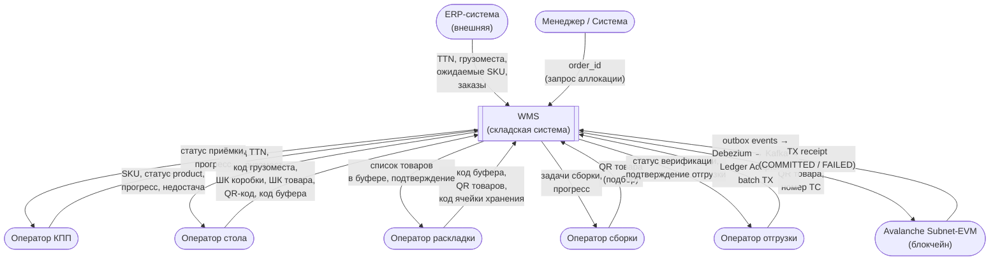
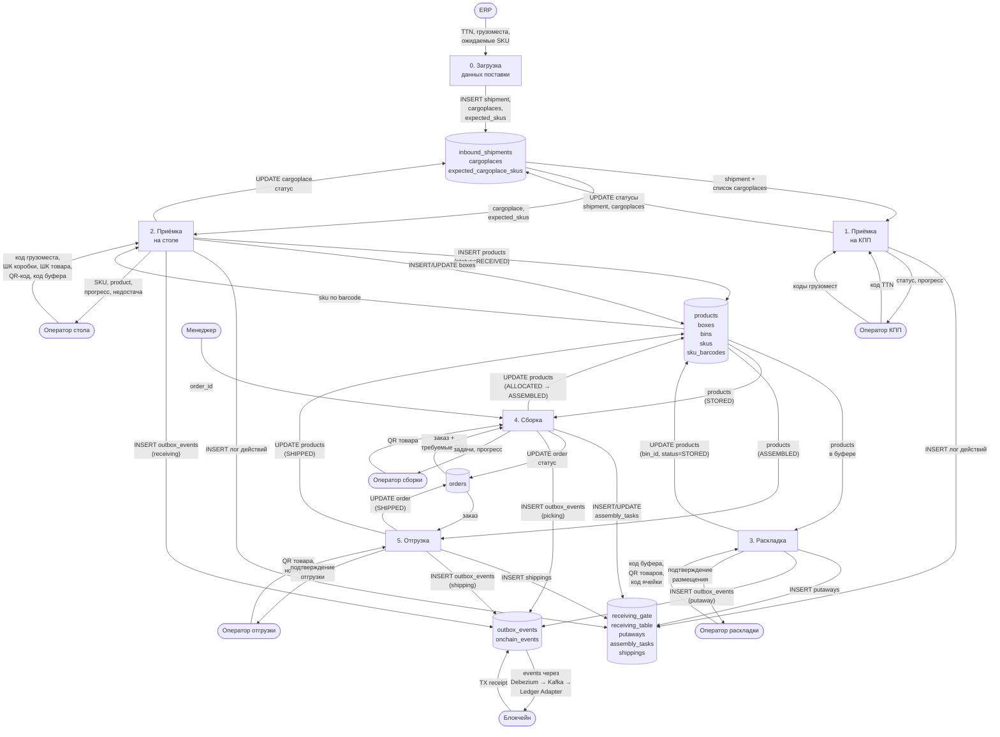
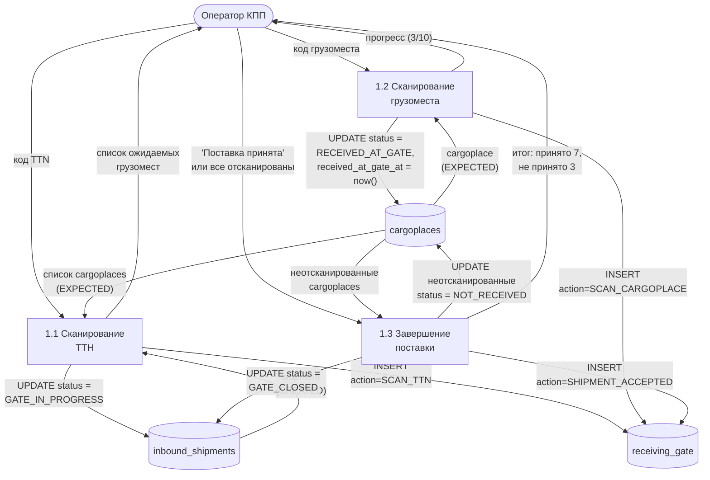
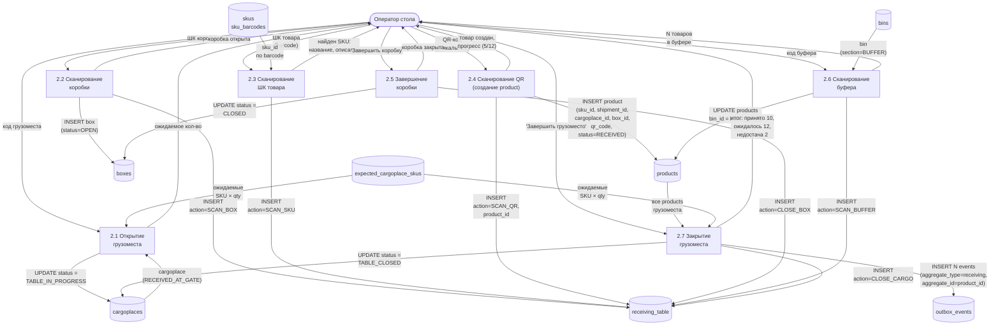
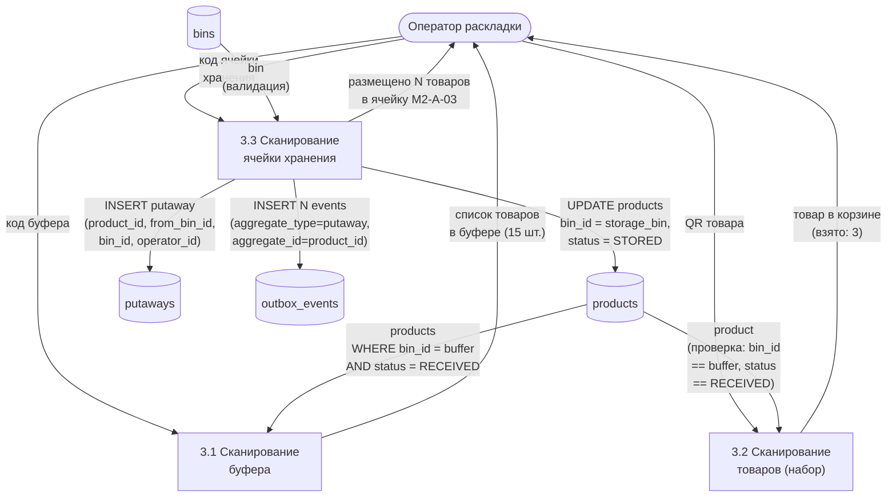
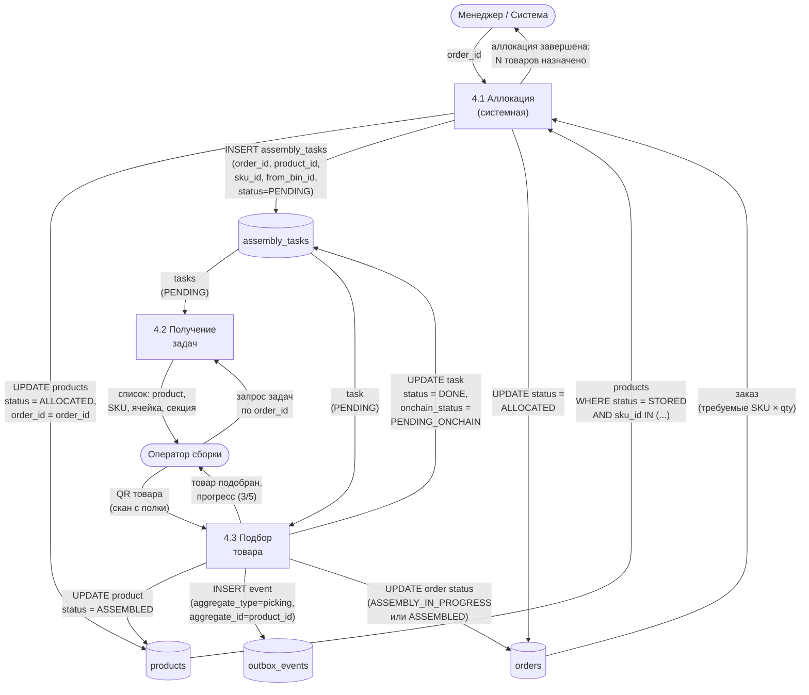
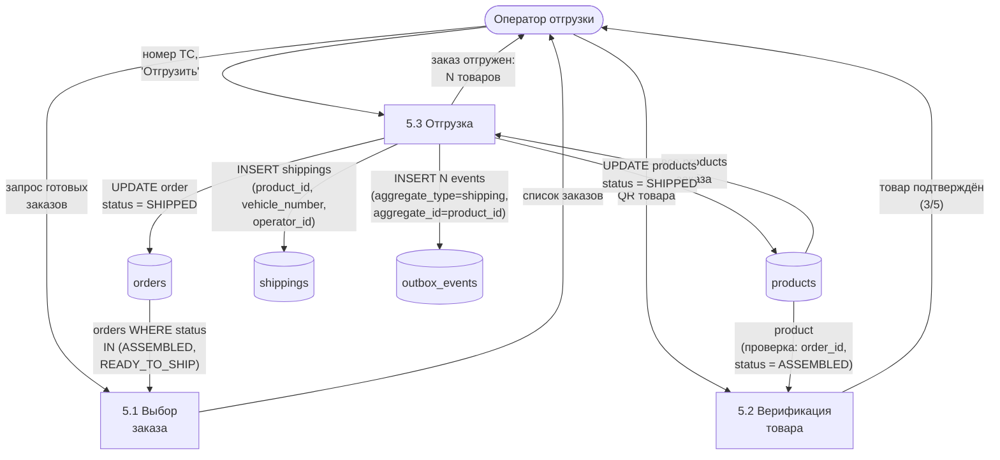
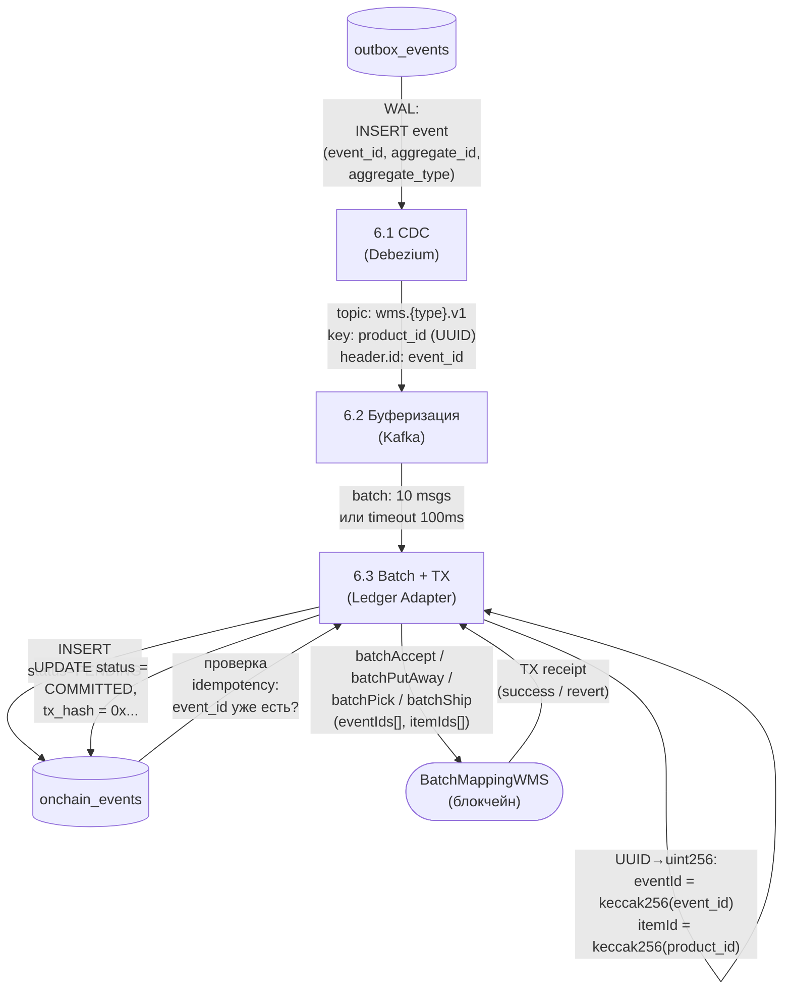

# Диаграммы потоков данных (DFD)

**Версия:** 1.0
**Дата:** 2026-03-31

---

## Level 0 — Контекстная диаграмма

Вся система как один процесс. Показывает внешние сущности и потоки данных между ними и WMS.

---

## Level 1 — Декомпозиция WMS на процессы

---

## Level 2 — Приёмка на КПП

**Выходные данные:** grузоместа в статусе RECEIVED_AT_GATE, готовые для приёмки на столе.
**Outbox events:** нет. Блокчейн не задействован.

---

## Level 2 — Приёмка на столе

**Ключевой момент:** product создаётся в шаге 2.4 (SCAN_QR), но outbox events создаются в шаге 2.7 (CLOSE_CARGO) — батчем, по 1 на каждый product.

---

## Level 2 — Раскладка

**Входные данные:** products в буфере (status=RECEIVED).
**Выходные данные:** products в ячейках хранения (status=STORED) + outbox events для блокчейна.

---

## Level 2 — Сборка

**Особенность:** аллокация (4.1) **не создаёт** outbox events. Только подбор (4.3) пишет в блокчейн.

---

## Level 2 — Отгрузка

**Финальная точка.** После отгрузки on-chain статус = Shipped. Данные товара больше не меняются.

---

## Level 2 — Интеграция (Outbox → Blockchain)

---

## Сводка: какие данные создаёт каждый процесс

| Процесс | Входные данные (от оператора) | Читает из хранилища | Пишет в хранилище | Outbox |
|---------|------------------------------|-------------------|-------------------|--------|
| 1. КПП | код TTN, коды грузомест | shipments, cargoplaces | shipments, cargoplaces, receiving_gate | — |
| 2. Стол | код грузоместа, ШК коробки, ШК товара, QR, код буфера | cargoplaces, expected_skus, sku_barcodes, bins | cargoplaces, boxes, **products**, receiving_table, **outbox_events** | receiving |
| 3. Раскладка | код буфера, QR товаров, код ячейки | products, bins | **products**, putaways, **outbox_events** | putaway |
| 4. Сборка | order_id (менеджер), QR товара (оператор) | orders, products | **products**, assembly_tasks, orders, **outbox_events** | picking |
| 5. Отгрузка | QR товара, номер ТС | products, orders | **products**, shippings, orders, **outbox_events** | shipping |
| 6. Интеграция | outbox_events (CDC) | onchain_events (idempotency) | onchain_events | → blockchain |
