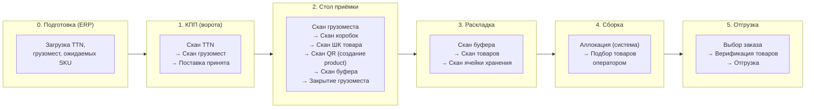
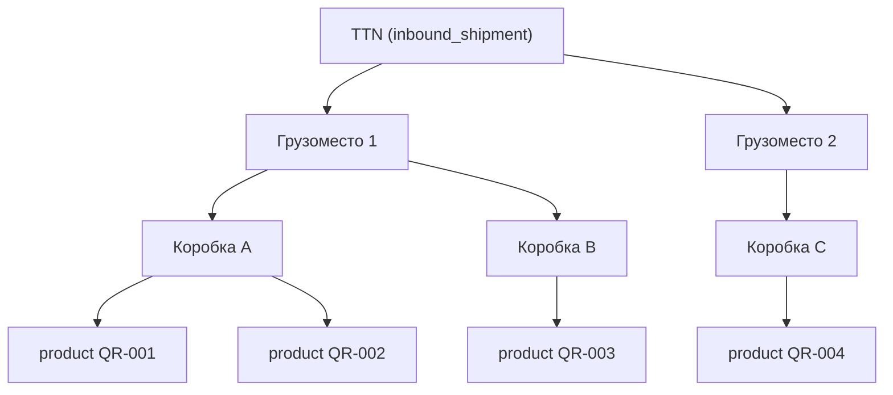
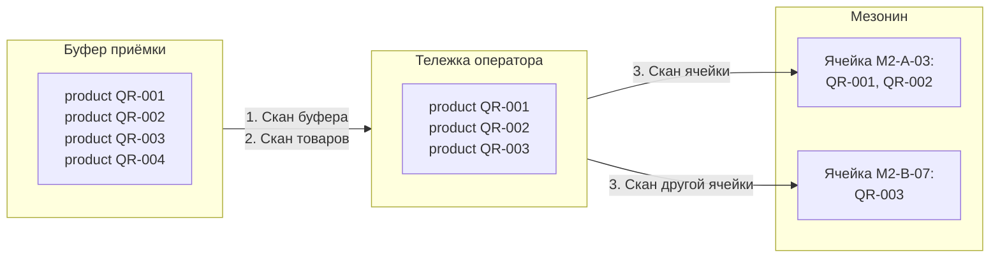
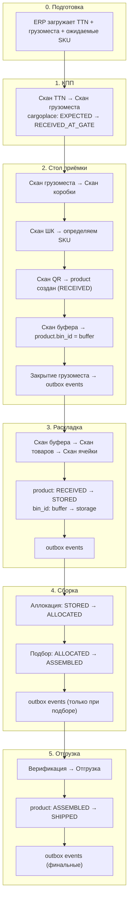

# Сквозной путь товара: от ворот до отгрузки

**Версия:** 1.0
**Дата:** 2026-03-31

Этот документ описывает полный жизненный цикл товара на складе — от момента, когда машина с грузом подъезжает к воротам, до момента, когда собранный заказ уезжает к клиенту. Каждый этап показан глазами оператора: что он делает, что видит на экране, и что происходит «под капотом».

---

## Общая картина



---

## 0. Подготовка (до начала работы на складе)

**Кто:** ERP-система (внешняя)
**Что происходит:** в БД WMS загружаются данные о предстоящей поставке.

**Создаются записи:**
- `inbound_shipments` — одна запись на TTN (статус `CREATED`)
- `cargoplaces` — по одной записи на каждое грузоместо (статус `EXPECTED`)
- `expected_cargoplace_skus` — ожидаемые SKU и количества в каждом грузоместе

**Блокчейн:** ничего не пишем. Данные плановые.

---

## 1. Приёмка на КПП (воротах)

**Кто:** оператор КПП
**Цель:** зафиксировать, какие грузоместа физически приехали на склад

### Что делает оператор

```
1. Сканирует штрихкод ТТН
   → Экран показывает список ожидаемых грузомест (например, 10 шт.)

2. Сканирует каждое грузоместо по очереди
   → Экран: "Грузоместо принято ✓ (3/10)"
   → Если грузоместо не из этой TTN — ошибка

3. Завершает поставку:
   a) Все 10 отсканированы → плашка "Поставка полностью принята"
   b) Отсканировано 7 из 10 → нажимает "Поставка принята"
      → 3 неотсканированных помечаются как NOT_RECEIVED
```

### Что меняется в системе

| Сущность | Было | Стало |
|----------|------|-------|
| `inbound_shipments.status` | CREATED | GATE_IN_PROGRESS → GATE_CLOSED |
| `cargoplaces.status` (отсканированные) | EXPECTED | RECEIVED_AT_GATE |
| `cargoplaces.status` (пропущенные) | EXPECTED | NOT_RECEIVED |
| `receiving_gate` | — | INSERT (лог каждого действия) |

### Блокчейн

**Ничего не пишем.** Товары (`products`) ещё не существуют — мы работаем с грузоместами как транспортными единицами. Блокчейн начинает работать только когда товар получает уникальный QR-код на столе приёмки.

### Подробнее

[receiving-gate-flow.md](../flows/receiving-gate-flow.md)

---

## 2. Приёмка на столе

**Кто:** оператор стола приёмки
**Цель:** вскрыть грузоместо, идентифицировать каждый товар, наклеить уникальный QR, разместить в буфер

### Что делает оператор

```
1. Сканирует грузоместо (только со статусом RECEIVED_AT_GATE)
   → Экран: "Грузоместо открыто. Ожидается X единиц товара"

2. Сканирует штрихкод коробки
   → Экран: "Коробка открыта. Сканируйте товары"

3. Для каждого товара в коробке:
   a) Сканирует ШК товара (штрихкод на упаковке)
      → Система определяет SKU по таблице sku_barcodes
      → Экран: "Найден SKU: Ноутбук Lenovo X1. Наклейте QR."

   b) Наклеивает QR-стикер и сканирует его
      → Система создаёт product (status=RECEIVED)
      → Экран: "Товар зарегистрирован ✓ (5/12)"

4. Нажимает "Завершить работу с коробкой"
   → Коробка закрывается (status=CLOSED)
   → Неотсканированные товары = недостача (нет записей product)

5. Сканирует ячейку буфера приёмки (у каждого стола — свой буфер)
   → Все products грузоместа размещаются в этот буфер (bin_id = buffer_bin_id)

6. Нажимает "Завершить работу с грузоместом"
   → Система сверяет: expected_cargoplace_skus vs реальные products
   → Создаются outbox events (по 1 на каждый product)
   → Экран: "Грузоместо закрыто (принято: 10, ожидалось: 12, недостача: 2)"
```

### Структура вложенности



### Что меняется в системе

| Сущность | Было | Стало |
|----------|------|-------|
| `cargoplaces.status` | RECEIVED_AT_GATE | TABLE_IN_PROGRESS → TABLE_CLOSED |
| `boxes` | — | INSERT (OPEN → CLOSED) |
| `products` | — | **INSERT** (status=RECEIVED, bin_id=NULL) |
| `products.bin_id` | NULL | buffer_bin_id (при скане буфера) |
| `receiving_table` | — | INSERT (лог каждого действия) |
| `outbox_events` | — | **INSERT** (N events при CLOSE_CARGO) |

### Блокчейн

При закрытии грузоместа (`CLOSE_CARGO`) создаётся **N outbox events** — по одному на каждый созданный product. Debezium публикует их в `wms.receiving.v1`. Ledger Adapter вызывает `batchAccept(eventIds[], itemIds[])`. On-chain переход: **None → Accepted**.

### Подробнее

[receiving-table-flow.md](../flows/receiving-table-flow.md)

---

## 3. Раскладка (Putaway)

**Кто:** оператор раскладки
**Цель:** перенести товары из буфера приёмки в ячейки хранения на мезонине

### Что делает оператор

```
1. Подходит к буферу, сканирует ячейку буфера
   → Экран: список товаров в буфере (15 шт.)

2. Сканирует QR товаров, которые берёт с собой
   → Экран: "Товар добавлен в корзину раскладки (взято: 3)"
   → Можно взять не все — остальные останутся в буфере

3. Физически кладёт товары на тележку и идёт к мезонину

4. Сканирует ячейку хранения на мезонине
   → Все товары из "корзины" размещаются в эту ячейку
   → Создаются outbox events (по 1 на каждый product)
   → Экран: "Размещено 3 товара в ячейку M2-A-03 ✓"

5. Может вернуться к буферу и продолжить раскладку оставшихся
```

### Физический процесс



### Что меняется в системе

| Сущность | Было | Стало |
|----------|------|-------|
| `products.status` | RECEIVED | STORED |
| `products.bin_id` | buffer_bin_id | storage_bin_id |
| `putaways` | — | INSERT (product_id, from_bin_id, bin_id, operator_id) |
| `outbox_events` | — | **INSERT** (1 per product) |

### Ограничения в MVP

Система **не проверяет** вместимость ячеек, совместимость SKU, зонирование. Оператор опирается на своё знание склада.

### Блокчейн

При размещении товаров в ячейку создаются outbox events → `wms.putaway.v1` → `batchPutAway(eventIds[], itemIds[])`. On-chain переход: **Accepted → PutAway**.

### Подробнее

[putaway-flow.md](../flows/putaway-flow.md)

---

## 4. Сборка заказа (Assembly / Picking)

**Кто:** система (аллокация) + оператор сборки (подбор)
**Цель:** назначить конкретные экземпляры товаров на заказ и физически собрать их

### Два этапа

#### 4a. Аллокация (системная, без оператора)

```
Менеджер / система → POST /assembly/allocate {order_id}
→ Система находит нужные products (status=STORED) по SKU заказа
→ Назначает конкретные экземпляры на заказ (FIFO или по ячейке)
→ Создаёт assembly_tasks для каждого product
```

**Outbox events НЕ создаются** — аллокация не меняет on-chain статус.

#### 4b. Подбор (оператор)

```
1. Открывает задачу сборки для заказа
   → Экран: список товаров с указанием ячеек (5 позиций)

2. Идёт к полкам, для каждого товара:
   → Сканирует QR товара
   → Экран: "Товар подобран ✓ (3/5)"
   → Создаётся outbox event

3. Когда все товары подобраны → заказ переходит в ASSEMBLED
```

### Что меняется в системе

| Сущность | Операция | Было | Стало |
|----------|----------|------|-------|
| `products.status` | Аллокация | STORED | ALLOCATED |
| `products.order_id` | Аллокация | NULL | order_id |
| `products.status` | Подбор | ALLOCATED | ASSEMBLED |
| `assembly_tasks.status` | Аллокация | — | INSERT (PENDING) |
| `assembly_tasks.status` | Подбор | PENDING | DONE |
| `orders.status` | — | NEW → ALLOCATED → ASSEMBLY_IN_PROGRESS → ASSEMBLED |
| `outbox_events` | Подбор | — | **INSERT** (1 per product, type='picking') |

### Блокчейн

При подборе каждого товара создаётся outbox event → `wms.picking.v1` → `batchPick(eventIds[], itemIds[])`. On-chain переход: **PutAway → Picked**.

### Подробнее

[assembly-flow.md](../flows/assembly-flow.md)

---

## 5. Отгрузка (Shipping)

**Кто:** оператор отгрузки
**Цель:** проверить собранный заказ и отправить его с клиентом/курьером

### Что делает оператор

```
1. Выбирает заказ для отгрузки (статус ASSEMBLED / READY_TO_SHIP)
   → Экран: список готовых заказов

2. Сканирует QR каждого товара в заказе (верификация)
   → Экран: "Товар подтверждён ✓ (3/5)"

3. Вводит номер транспортного средства, нажимает "Отгрузить"
   → Все products → SHIPPED
   → Создаются outbox events (по 1 на каждый product)
   → Заказ → SHIPPED
   → Экран: "Заказ отгружен: 5 товаров ✓"
```

### Что меняется в системе

| Сущность | Было | Стало |
|----------|------|-------|
| `products.status` | ASSEMBLED | SHIPPED |
| `shippings` | — | INSERT (product_id, vehicle_number, operator_id) |
| `orders.status` | ASSEMBLED / READY_TO_SHIP | SHIPPED |
| `outbox_events` | — | **INSERT** (N events, type='shipping') |

### Блокчейн

При отгрузке создаются outbox events → `wms.shipping.v1` → `batchShip(eventIds[], itemIds[])`. On-chain переход: **Picked → Shipped**. Это **финальный переход** — после Shipped статус на блокчейне не меняется.

### Подробнее

[shipping-flow.md](../flows/shipping-flow.md)

---

## Сводка: путь одного товара



## Параллельный on-chain трек

Каждый outbox event проходит один и тот же путь:

```
outbox_events (PG) → Debezium (CDC) → Kafka topic → Ledger Adapter → BatchMappingWMS (Blockchain)
```

| Этап WMS | Outbox aggregate_type | Kafka topic | Контракт | On-chain переход |
|----------|----------------------|-------------|----------|-----------------|
| Стол приёмки (CLOSE_CARGO) | `receiving` | `wms.receiving.v1` | `batchAccept` | None → Accepted |
| Раскладка | `putaway` | `wms.putaway.v1` | `batchPutAway` | Accepted → PutAway |
| Сборка (подбор) | `picking` | `wms.picking.v1` | `batchPick` | PutAway → Picked |
| Отгрузка | `shipping` | `wms.shipping.v1` | `batchShip` | Picked → Shipped |

**КПП** — единственный этап без on-chain записи (товары ещё не существуют).
