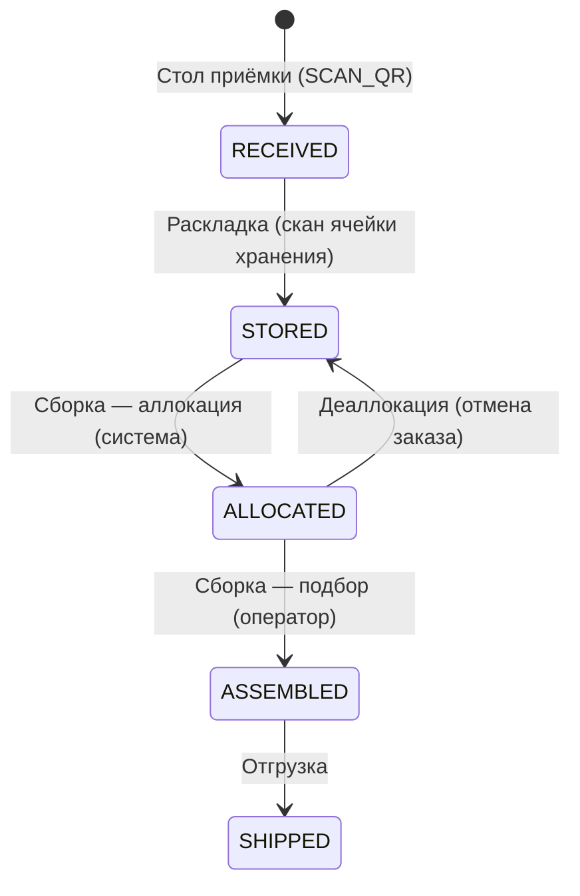
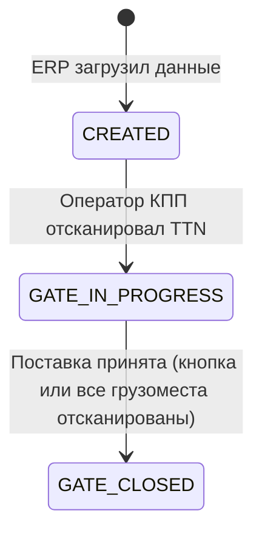
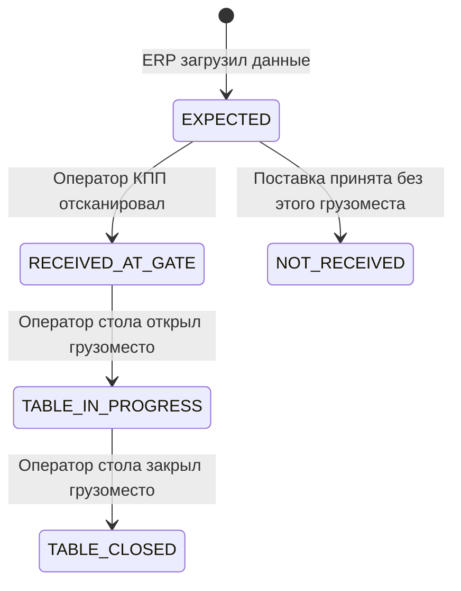
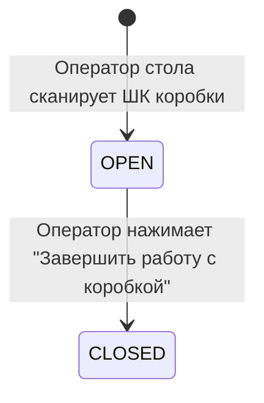
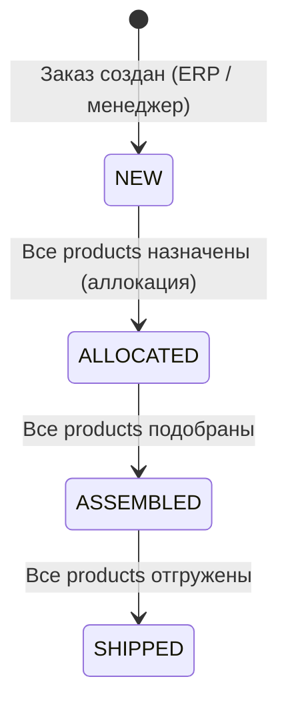
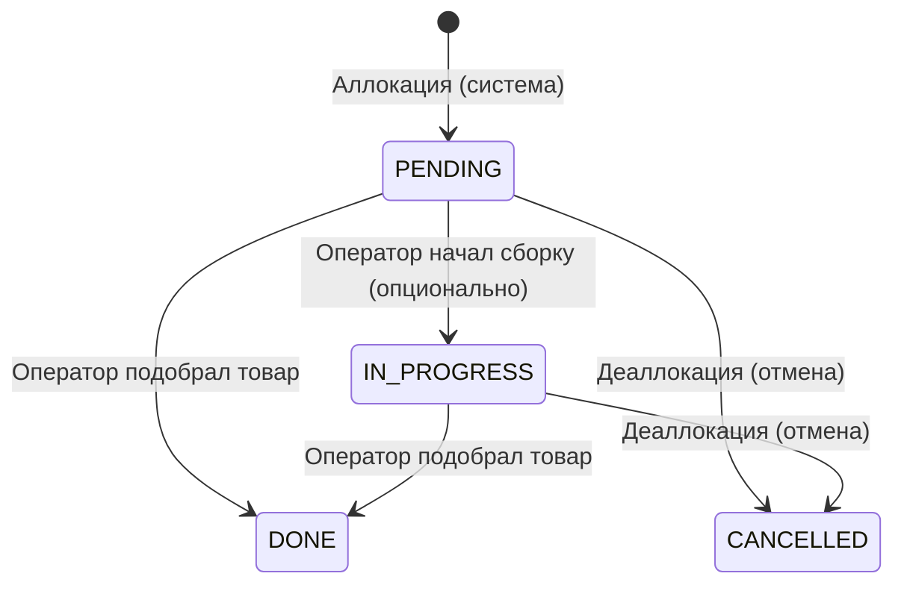
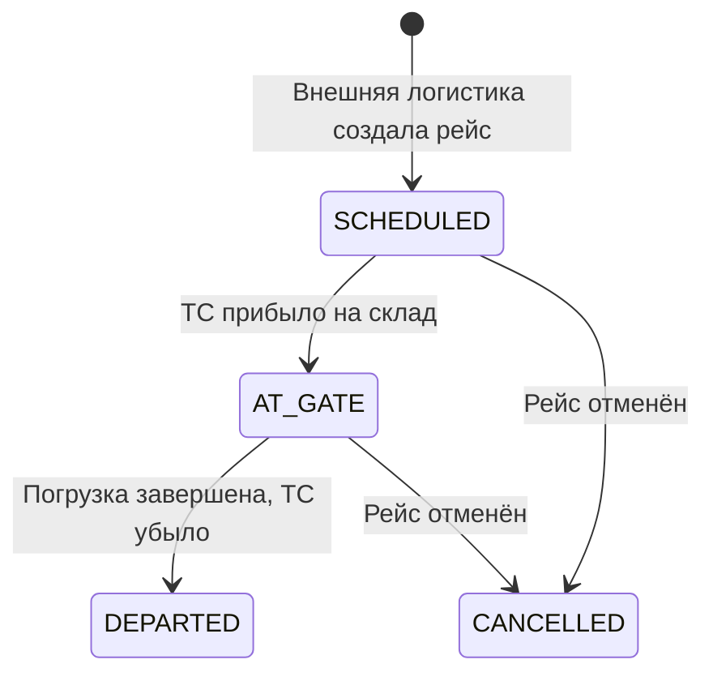
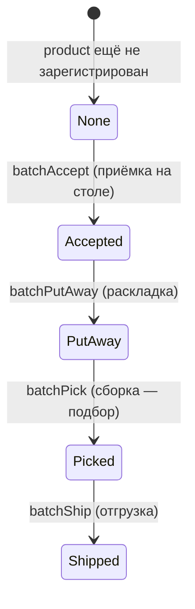
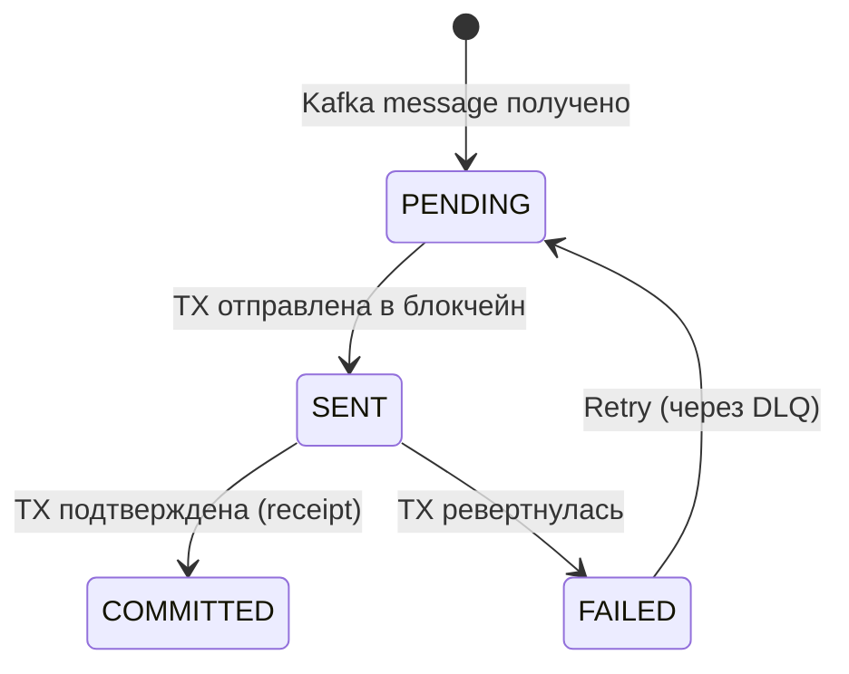

# Жизненные циклы сущностей

**Версия:** 1.0
**Дата:** 2026-03-31

Все сущности системы, их статусы и переходы — в одном месте. Для каждой сущности указано: какой этап WMS вызывает переход, и есть ли побочные эффекты (outbox events, блокчейн).

---

## products (ключевая сущность)

Единица товара. Создаётся на столе приёмки при сканировании QR. Является объектом отслеживания на блокчейне.

| Переход | Этап WMS | Кто инициирует | Outbox event | On-chain |
|---------|----------|---------------|--------------|----------|
| — → RECEIVED | Стол приёмки | Оператор (SCAN_QR) | Нет (создаётся при CLOSE_CARGO) | — |
| RECEIVED → STORED | Раскладка | Оператор | `putaway` | Accepted → PutAway |
| STORED → ALLOCATED | Сборка | Система | Нет | — |
| ALLOCATED → STORED | Деаллокация | Система | Нет | — |
| ALLOCATED → ASSEMBLED | Сборка | Оператор (подбор) | `picking` | PutAway → Picked |
| ASSEMBLED → SHIPPED | Отгрузка | Оператор | `shipping` | Picked → Shipped |

**Особенность:** outbox event для `receiving` создаётся **не при смене статуса product**, а позже — при закрытии грузоместа (CLOSE_CARGO). Между INSERT product и outbox event проходит несколько шагов (сканирование буфера, закрытие коробок).

### Связанные поля, меняющиеся вместе со статусом

| Статус | bin_id | order_id |
|--------|--------|----------|
| RECEIVED | NULL → buffer_bin_id (при SCAN_BUFFER) | NULL |
| STORED | storage_bin_id | NULL |
| ALLOCATED | storage_bin_id (не меняется) | order_id |
| ASSEMBLED | storage_bin_id | order_id |
| SHIPPED | storage_bin_id | order_id |

---

## inbound_shipments (TTN / поставка)

Транспортная накладная. Верхнеуровневая сущность этапа КПП.

| Переход | Этап WMS | Триггер |
|---------|----------|---------|
| — → CREATED | Подготовка | ERP загружает данные |
| CREATED → GATE_IN_PROGRESS | КПП | POST /receiving/gate/scan-ttn |
| GATE_IN_PROGRESS → GATE_CLOSED | КПП | POST /receiving/gate/accept-shipment или автоматически |

---

## cargoplaces (грузоместо)

Транспортная единица в составе TTN. Содержит коробки с товарами.

| Переход | Этап WMS | Триггер |
|---------|----------|---------|
| — → EXPECTED | Подготовка | ERP загружает данные |
| EXPECTED → RECEIVED_AT_GATE | КПП | POST /receiving/gate/scan-cargoplace |
| EXPECTED → NOT_RECEIVED | КПП | POST /receiving/gate/accept-shipment (массово) |
| RECEIVED_AT_GATE → TABLE_IN_PROGRESS | Стол приёмки | POST /receiving/table/scan-cargoplace |
| TABLE_IN_PROGRESS → TABLE_CLOSED | Стол приёмки | POST /receiving/table/close-cargoplace |

---

## boxes (коробка)

Упаковочная единица внутри грузоместа. Используется только для структурного учёта на этапе приёмки.

| Переход | Этап WMS | Триггер |
|---------|----------|---------|
| — → OPEN | Стол приёмки | POST /receiving/table/scan-box |
| OPEN → CLOSED | Стол приёмки | POST /receiving/table/close-box |

---

## orders (заказ клиента)

Заказ, содержащий несколько позиций (SKU × количество). Товары назначаются на заказ при аллокации.

| Переход | Этап WMS | Триггер |
|---------|----------|---------|
| — → NEW | — | Создание заказа |
| NEW → ALLOCATED | Сборка | POST /assembly/allocate (все products назначены) |
| ALLOCATED → ASSEMBLED | Сборка | POST /assembly/pick (последний product подобран) |
| ASSEMBLED → SHIPPED | Отгрузка | POST /shipping/ship |

---

## assembly_tasks (задача сборки)

Задача подбора одного товара для заказа. Создаётся системой при аллокации.

---

## outbound_dispatches (исходящий рейс)

Плановый исходящий рейс, создаваемый внешней логистикой до погрузки. Содержит номер ТС (`vehicle_number`) и другую логистическую информацию. Используется на этапе отгрузки через `dispatch_id`.

| Переход | Этап WMS | Триггер |
|---------|----------|---------|
| — → SCHEDULED | Подготовка | Внешняя логистика создаёт рейс до погрузки |
| SCHEDULED → AT_GATE | Отгрузка | ТС прибыло на склад |
| AT_GATE → DEPARTED | Отгрузка | Погрузка завершена, ТС убыло |
| SCHEDULED → CANCELLED | — | Оператор отменил рейс |
| AT_GATE → CANCELLED | — | Оператор отменил рейс |

## On-chain статус (BatchMappingWMS)

Параллельный трек жизненного цикла товара на блокчейне. Каждый переход соответствует off-chain операции.

| On-chain статус | Off-chain статус product | Кто вызывает | Kafka topic |
|----------------|------------------------|-------------|-------------|
| None → Accepted | RECEIVED | Ledger Adapter | wms.receiving.v1 |
| Accepted → PutAway | STORED | Ledger Adapter | wms.putaway.v1 |
| PutAway → Picked | ASSEMBLED | Ledger Adapter | wms.picking.v1 |
| Picked → Shipped | SHIPPED | Ledger Adapter | wms.shipping.v1 |

---

## onchain_events (статус записи на блокчейн)

Таблица, управляемая Ledger Adapter. Отслеживает прогресс отправки каждого события на блокчейн.

---

## Сводная таблица: все сущности и этапы

| Сущность | КПП | Стол | Раскладка | Сборка | Отгрузка |
|----------|-----|------|-----------|--------|----------|
| inbound_shipments | CREATED → GATE_CLOSED | — | — | — | — |
| cargoplaces | EXPECTED → RECEIVED/NOT | → TABLE_CLOSED | — | — | — |
| boxes | — | OPEN → CLOSED | — | — | — |
| products | — | INSERT (RECEIVED) | → STORED | → ALLOCATED → ASSEMBLED | → SHIPPED |
| orders | — | — | — | NEW → ALLOCATED → ASSEMBLED | → SHIPPED |
| order_lines | — | — | — | INSERT (создаётся вместе с заказом) | — |
| assembly_tasks | — | — | — | INSERT → DONE | — |
| outbound_dispatches | — | — | — | — | SCHEDULED → AT_GATE → DEPARTED |
| putaways | — | — | INSERT | — | — |
| shippings | — | — | — | — | INSERT (с dispatch_id) |
| outbox_events | — | INSERT (receiving) | INSERT (putaway) | INSERT (picking) | INSERT (shipping) |
| receiving_gate | INSERT | — | — | — | — |
| receiving_table | — | INSERT | — | — | — |
