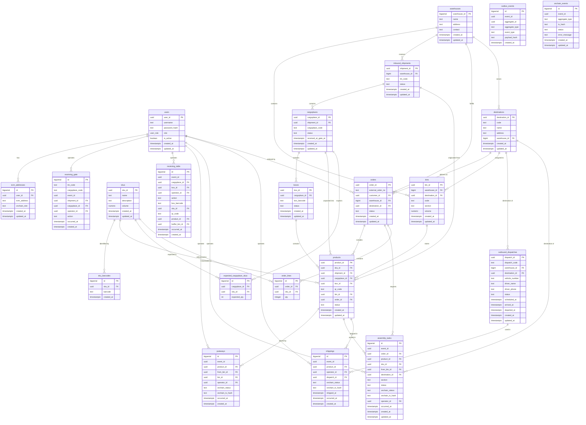
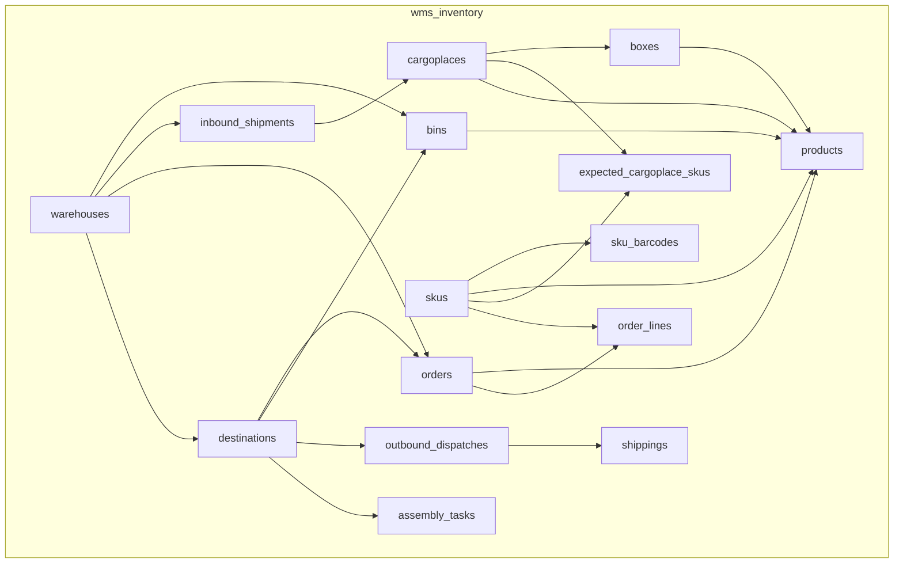
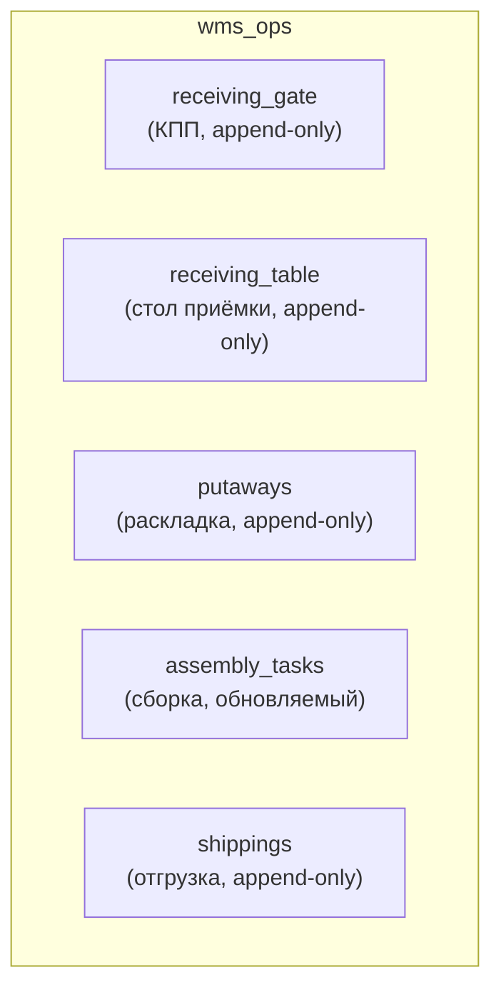
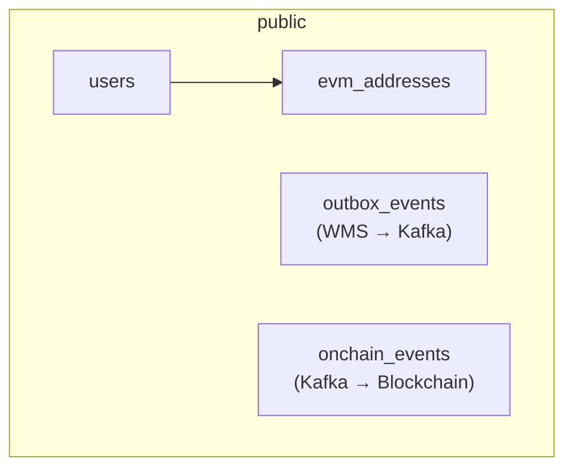

# ER-диаграмма: связи между таблицами

**Версия:** 1.0
**Дата:** 2026-03-31

---

## Полная ER-диаграмма



---

## Группировка по схемам PostgreSQL

### wms_inventory (справочники и состояние)



**Назначение:** текущее состояние склада. Где какой товар, в каком статусе, к какому заказу привязан.

### wms_ops (журналы операций)



**Назначение:** журнал всех операций. Кто, когда, что сделал. Операции (кроме assembly_tasks) — append-only.

### public (общие + события)



**Назначение:** пользователи, EVM-адреса, интеграционные таблицы.

---

## Ключевые связи

### Путь данных: TTN → product

```
inbound_shipments (TTN)
  └── cargoplaces (грузоместо)
        ├── expected_cargoplace_skus (ожидаемые SKU × qty)
        ├── boxes (коробки)
        │     └── products (товары, bin_id → bins)
        └── products (товары без коробки — теоретически)
```

### Путь данных: order → shipment

```
orders (заказ → destination_id)
  ├── order_lines (строки заказа: SKU × qty)
  └── products (order_id назначен при аллокации)
        └── assembly_tasks (задачи подбора → destination_id)
              └── shippings (записи отгрузки → dispatch_id)
                    └── outbound_dispatches (рейс, содержит vehicle_number)
```

### Связь off-chain ↔ on-chain

```
products.product_id
  → outbox_events.aggregate_id (= product_id)
    → Kafka message key (= product_id UUID string)
      → onchain_events.event_id (= outbox_events.event_id)
        → BatchMappingWMS.itemStatus[uint256(keccak256(product_id))]
```

---

## Уникальные ограничения

| Таблица | Constraint | Назначение |
|---------|-----------|------------|
| `inbound_shipments` | UNIQUE(ttn_code) | Один TTN = одна поставка |
| `cargoplaces` | UNIQUE(shipment_id, cargoplace_code) | Грузоместо уникально в рамках TTN |
| `boxes` | UNIQUE(cargoplace_id, box_barcode) | Коробка уникальна в рамках грузоместа |
| `products` | UNIQUE(qr_code) | QR глобально уникален |
| `sku_barcodes` | UNIQUE(barcode) | Штрихкод глобально уникален |
| `skus` | UNIQUE(name) | Название SKU уникально |
| `destinations` | UNIQUE(code) | Код магазина-получателя глобально уникален |
| `order_lines` | UNIQUE(order_id, sku_id) | Одна позиция SKU в заказе уникальна |
| `outbound_dispatches` | UNIQUE(dispatch_code) | Код рейса глобально уникален |
| `onchain_events` | UNIQUE(event_id) | Идемпотентность Ledger Adapter |
| `expected_cargoplace_skus` | UNIQUE(cargoplace_id, sku_id) | Один SKU на грузоместо |

### CHECK-ограничения и индексы

| Таблица | Constraint / Index | Назначение |
|---------|-------------------|------------|
| `bins` | CHECK `bins_shipping_buffer_requires_destination` | Если `section = 'SHIPPING_BUFFER'`, то `destination_id IS NOT NULL` |
| `bins` | partial-индекс `idx_bins_destination_id` | Ускоряет поиск по `destination_id` только для ячеек `SHIPPING_BUFFER` |
| `order_lines` | CHECK `order_lines_qty_positive` | `qty > 0` |
