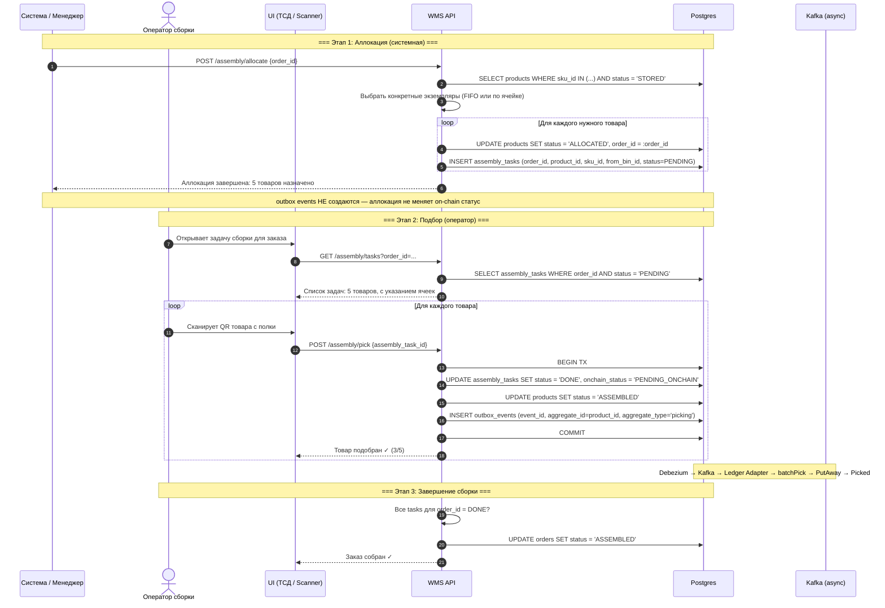
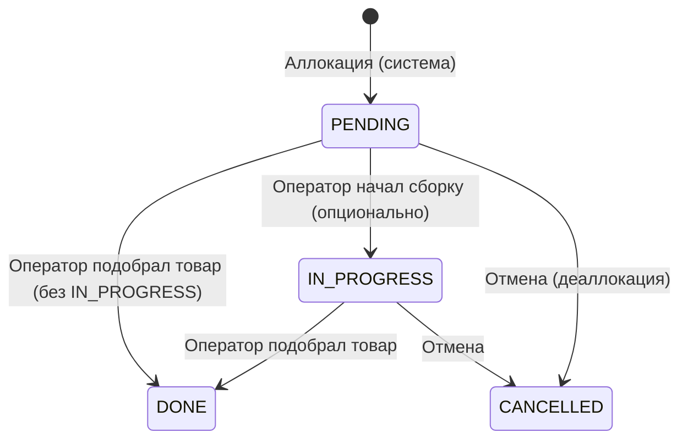
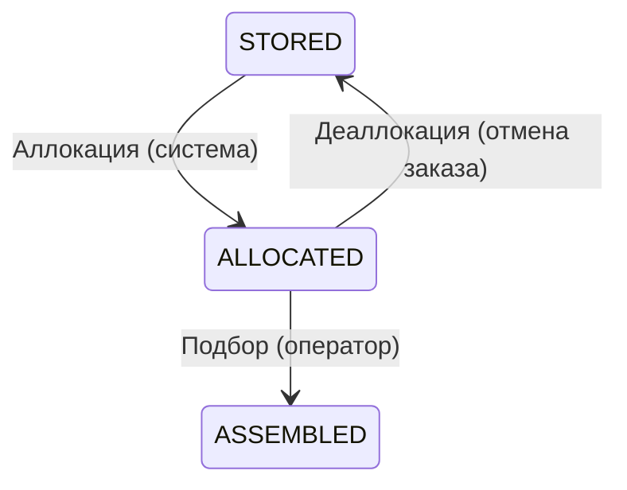
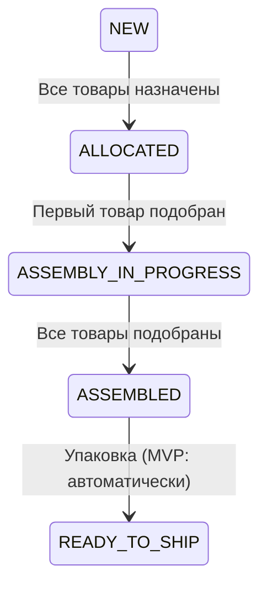
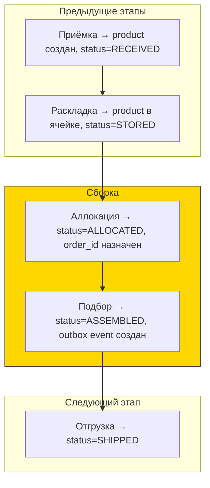

# Сборка заказа (Assembly / Picking)

## Суть

Подбор товаров со стеллажей по заказу клиента. Два этапа: система назначает товары (аллокация), оператор физически их собирает (подбор).

**Ключевое:** аллокация — системная операция (без оператора). Подбор — физическая операция оператора. Outbox event создаётся **только при подборе** (когда товар физически взят с полки).

## Диаграмма последовательности



## Состояния сущностей

### assembly_tasks.status


### products.status (в контексте сборки)


### orders.status


## Какие таблицы затрагиваются

| Таблица | Операция | Что меняется |
|---------|----------|-------------|
| `products` | UPDATE | status: STORED → ALLOCATED → ASSEMBLED |
| `products` | UPDATE | order_id: NULL → order_id (при аллокации) |
| `assembly_tasks` | INSERT | Создание задач подбора (при аллокации) |
| `assembly_tasks` | UPDATE | status: PENDING → DONE, onchain_status = PENDING_ONCHAIN |
| `orders` | UPDATE | status: NEW → ALLOCATED → ASSEMBLED |
| `outbox_events` | INSERT | **Только при подборе** (1 event per product, aggregate_type='picking') |

## Outbox events

```sql
-- При каждом POST /assembly/pick (в той же транзакции):
INSERT INTO outbox_events (event_id, aggregate_id, aggregate_type, event_type, payload_hash)
VALUES (
  assembly_task.event_id,    -- тот же event_id что и в assembly_tasks
  assembly_task.product_id,  -- product_id → Kafka key → itemId в контракте
  'picking',                 -- → topic: wms.picking.v1
  'wms.picking.v1',
  sha256(...)
);
```

**Блокчейн:** `batchPick(eventIds[], itemIds[])` → переход `PutAway → Picked`.

## Связь с предыдущими этапами


