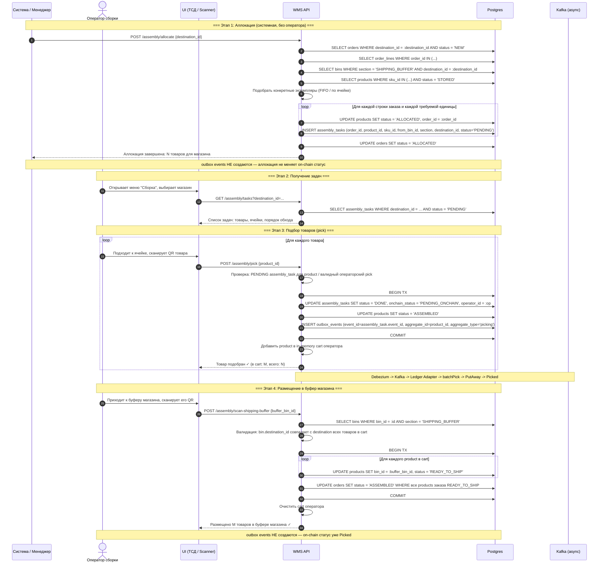
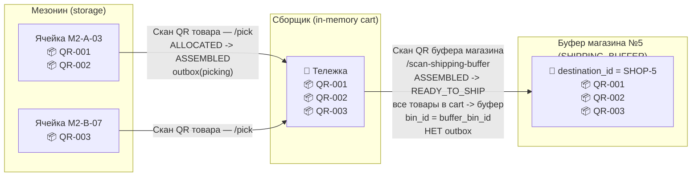
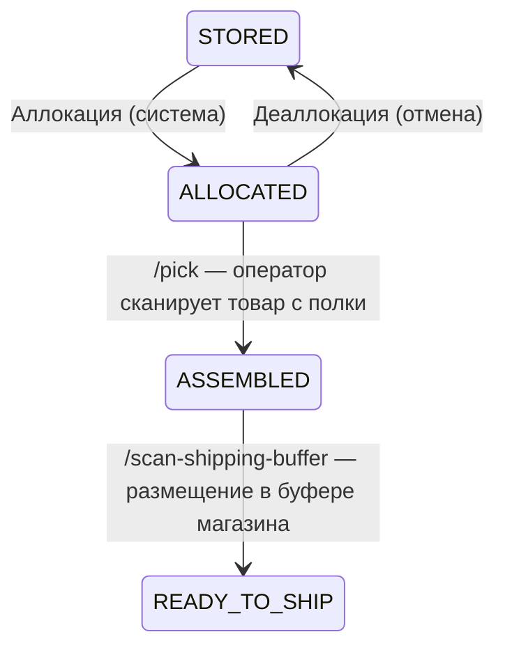
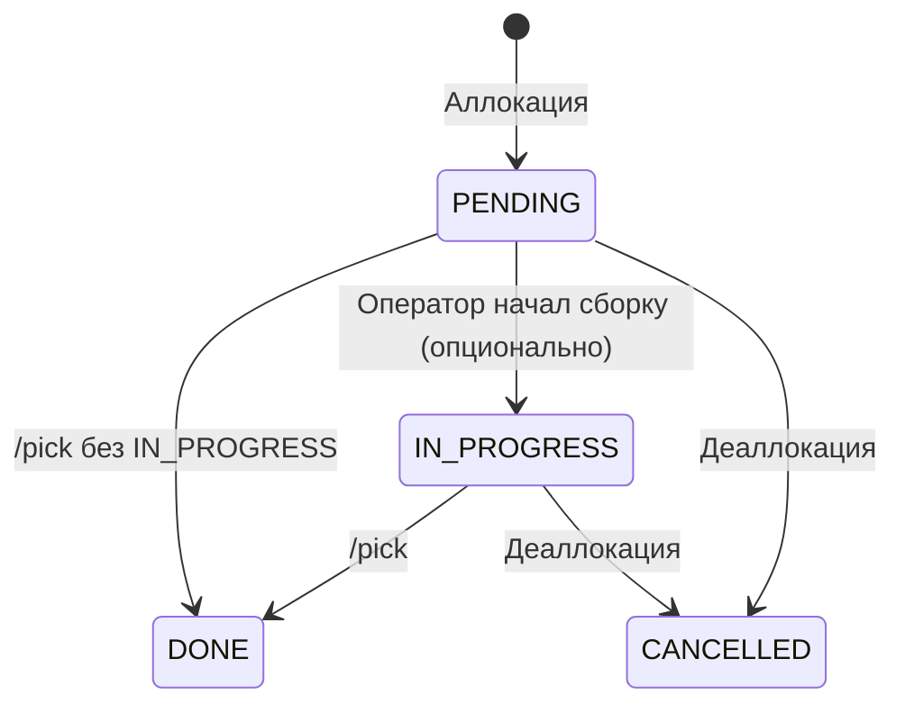
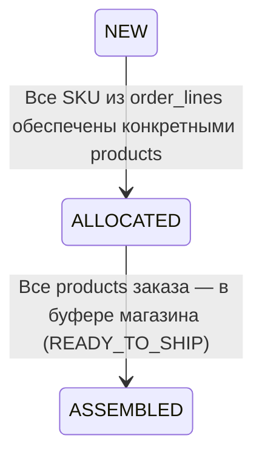
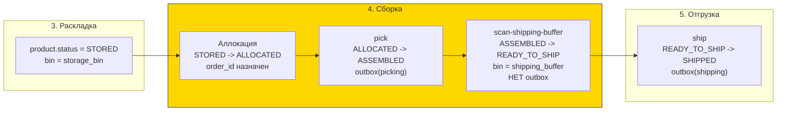

# Сборка заказа (Assembly / Picking)

## Суть

Подбор товаров для отгрузки в конкретный магазин. Поток работает **по магазинам (`destination_id`)**: система читает `NEW` заказы и их `order_lines`, аллоцирует конкретные `products`, создаёт `assembly_tasks`, а оператор физически подбирает товары и переносит их в `SHIPPING_BUFFER` этого магазина.

**Ключевое:**

- `order_lines` определяют, какие SKU и в каком количестве нужно собрать.
- `orders.destination_id` фиксирует магазин-получатель.
- `assembly_tasks.destination_id` денормализует магазин в задачу, чтобы оператор работал с пачкой задач для одного destination.
- `SHIPPING_BUFFER` закреплён за конкретным `destination_id` и используется как staging исходящего потока.
- `pick` — физическая операция оператора, создаёт outbox `picking` -> on-chain переход `PutAway -> Picked`.
- `scan-shipping-buffer` — физическое перемещение в буфер магазина, **без outbox**: on-chain статус уже `Picked`, смена bin — off-chain деталь.
- Паттерн симметричен раскладке (putaway), только в обратную сторону: `storage -> cart -> shipping_buffer` вместо `buffer -> cart -> storage`.

### Три этапа

1. **Аллокация** (системная) — система находит `NEW` заказы для магазина, читает `order_lines`, подбирает `STORED` products по SKU и создаёт `assembly_tasks`.
2. **Подбор (pick)** — оператор обходит полки, сканирует QR каждого товара. Товар попадает в in-memory cart оператора, статус переходит в `ASSEMBLED`, создаётся outbox event.
3. **Размещение в буфер магазина** — оператор приходит в зону буфера, сканирует его. Все товары из cart попадают в буфер, статус товара переходит в `READY_TO_SHIP`. Outbox не создаётся.

## Диаграмма последовательности



## Физический процесс



## Состояния сущностей

### products.status (в контексте сборки)



Промежуточный статус `ASSEMBLED` означает «товар в руках сборщика, ещё не доставлен в буфер». После `scan-shipping-buffer` товар физически лежит в `SHIPPING_BUFFER` bin и ждёт машину.

### assembly_tasks.status



### orders.status (в контексте сборки)



**Важно:** `orders.status = ASSEMBLED` наступает **когда все products заказа уже в буфере** после `scan-shipping-buffer`, а не когда они просто подобраны в статус `ASSEMBLED`. До этого заказ остаётся в `ALLOCATED`.

## Какие таблицы затрагиваются

| Таблица | Операция | Этап | Что меняется |
|---------|----------|------|--------------|
| `orders` | SELECT / UPDATE | Аллокация -> сборка | Читается `destination_id`, статус `NEW -> ALLOCATED -> ASSEMBLED` |
| `order_lines` | SELECT | Аллокация | Источник потребности по SKU и количеству |
| `products.status` | UPDATE | Аллокация | `STORED -> ALLOCATED` |
| `products.status` | UPDATE | `/pick` | `ALLOCATED -> ASSEMBLED` |
| `products.status` | UPDATE | `/scan-shipping-buffer` | `ASSEMBLED -> READY_TO_SHIP` |
| `products.order_id` | UPDATE | Аллокация | `NULL -> :order_id` |
| `products.bin_id` | UPDATE | `/scan-shipping-buffer` | `storage_bin -> shipping_buffer_bin` |
| `assembly_tasks` | INSERT | Аллокация | Создание задач подбора с `destination_id`, `status = PENDING` |
| `assembly_tasks` | UPDATE | `/pick` | `status: PENDING/IN_PROGRESS -> DONE`, `onchain_status = PENDING_ONCHAIN` |
| `bins` | SELECT | Аллокация / буфер | Обычные storage bins и destination-specific `SHIPPING_BUFFER` |
| `outbox_events` | INSERT | **только `/pick`** | 1 event per product, `aggregate_type = 'picking'` |

## Outbox events

Создаются **только при `/assembly/pick`**, в той же транзакции:

```sql
INSERT INTO outbox_events (event_id, aggregate_id, aggregate_type, event_type, payload_hash)
VALUES (
  assembly_task.event_id,
  assembly_task.product_id,
  'picking',
  'wms.picking.v1',
  sha256(payload)
);
```

**Блокчейн:** `batchPick(eventIds[], itemIds[])` -> переход `PutAway -> Picked`.

Ledger Adapter автоматически батчит N последовательных pick'ов в одну on-chain транзакцию (по max-size или timeout окну). Дополнительных усилий для батчинга в WMS не требуется.

**При `/assembly/scan-shipping-buffer` outbox НЕ создаётся** — on-chain статус остаётся `Picked`, перемещение в буфер магазина — off-chain деталь физического процесса.

## In-memory cart оператора

Аналогично раскладке (putaway):

- `assembly.Service` хранит `map[operator_id][]product_id` + `sync.RWMutex`.
- Заполняется при каждом успешном `/assembly/pick`.
- Очищается при успешном `/assembly/scan-shipping-buffer`.
- **Не персистентный:** при рестарте WMS cart теряется. Для MVP это приемлемо: уже сделанные pick'и сохранены в БД (`assembly_tasks.status = DONE`), оператор просто заново сканирует буфер и получает свежий список своих `ASSEMBLED` товаров.

**Частичная сдача поддерживается:** оператор может собрать 5 товаров и сразу отнести в буфер, потом собрать ещё 10 и отнести снова. Каждый цикл `pick` + `scan-shipping-buffer` независим.

## Валидации

| Условие | Ошибка |
|---------|--------|
| `/allocate`: нет `SHIPPING_BUFFER` для `destination_id` | `SHIPPING_BUFFER_NOT_FOUND` |
| `/allocate`: недостаточно `STORED` products по SKU | `INSUFFICIENT_STOCK` |
| `/allocate`: заказ уже в статусе != `NEW` | `ORDER_NOT_NEW` |
| `/pick`: `product.status != ALLOCATED` | `PRODUCT_NOT_ALLOCATED` |
| `/pick`: нет `PENDING` / `IN_PROGRESS` assembly_task для product | `NO_TASK_FOR_PRODUCT` |
| `/scan-shipping-buffer`: cart оператора пуст | `CART_EMPTY` |
| `/scan-shipping-buffer`: `bin.section != 'SHIPPING_BUFFER'` | `BIN_NOT_SHIPPING_BUFFER` |
| `/scan-shipping-buffer`: в cart есть товар с destination != `bin.destination_id` | `DESTINATION_MISMATCH` |

`DESTINATION_MISMATCH` защищает от ситуации «сборщик собирал для магазина №5, а сканирует буфер магазина №7». Ни один товар из cart не применяется, оператору сообщается о проблеме.

## Связь с соседними этапами


