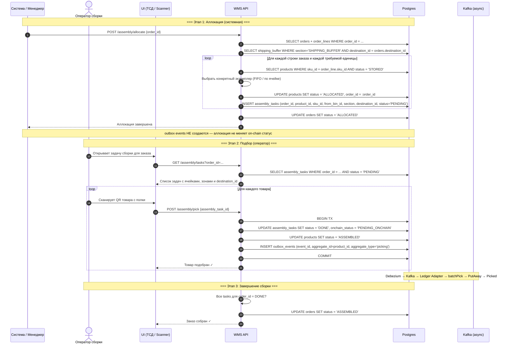
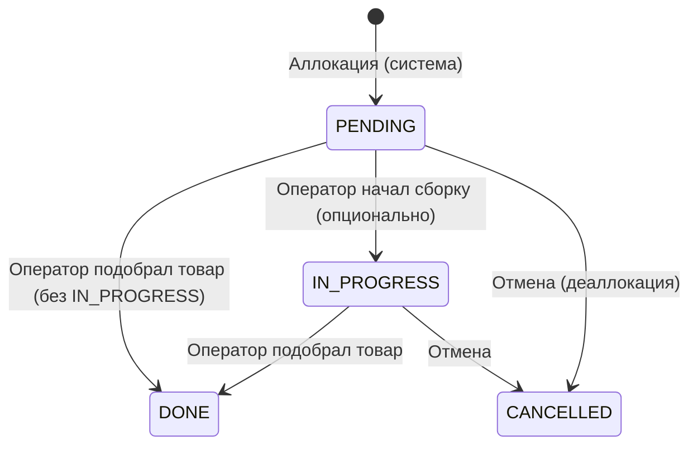
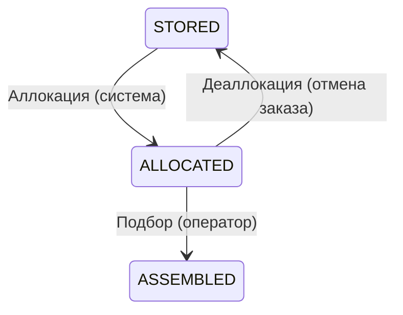
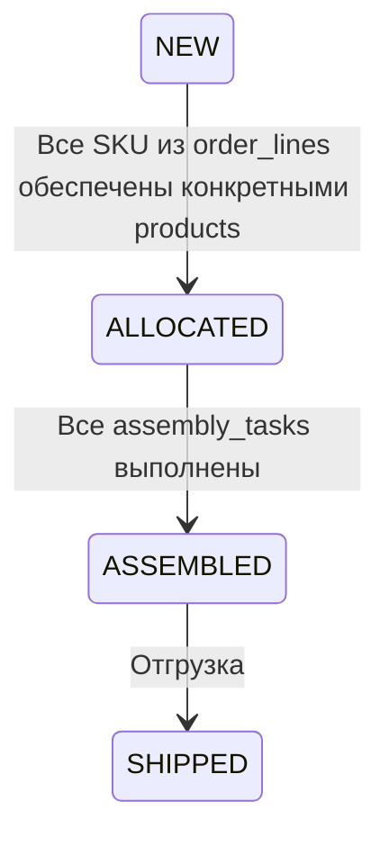

# Сборка заказа (Assembly / Picking)

## Суть

Подбор товаров со стеллажей по заказу клиента. Два этапа:

- система читает `order_lines` и аллоцирует конкретные `products`
- оператор физически подбирает товар по созданным `assembly_tasks`

**Ключевое в новой схеме:**

- `order_lines` определяют, **какие SKU и в каком количестве** нужно собрать
- `orders.destination_id` фиксирует магазин-получатель
- `assembly_tasks.destination_id` денормализует магазин в задачу
- `SHIPPING_BUFFER` резервируется под staging исходящего потока для конкретного `destination_id`

## Диаграмма последовательности



## Состояния сущностей

### assembly_tasks.status



### products.status (в контексте сборки)



### orders.status



## Какие таблицы затрагиваются

| Таблица | Операция | Что меняется |
|---------|----------|-------------|
| `orders` | SELECT / UPDATE | Читается `destination_id`, статус: `NEW → ALLOCATED → ASSEMBLED` |
| `order_lines` | SELECT | Источник потребности по SKU и количеству |
| `products` | UPDATE | `status: STORED → ALLOCATED → ASSEMBLED` |
| `products` | UPDATE | `order_id: NULL → order_id` при аллокации |
| `assembly_tasks` | INSERT | Создание задач подбора с `destination_id` |
| `assembly_tasks` | UPDATE | `status: PENDING → DONE`, `onchain_status = PENDING_ONCHAIN` |
| `bins` | SELECT | Используются обычные storage bins и destination-specific `SHIPPING_BUFFER` |
| `outbox_events` | INSERT | Только при подборе: `aggregate_type='picking'` |

## Outbox events

```sql
-- При каждом POST /assembly/pick (в той же транзакции):
INSERT INTO outbox_events (event_id, aggregate_id, aggregate_type, event_type, payload_hash)
VALUES (
  assembly_task.event_id,
  assembly_task.product_id,
  'picking',
  'wms.picking.v1',
  sha256(...)
);
```

**Блокчейн:** `batchPick(eventIds[], itemIds[])` → переход `PutAway → Picked`.

## Примечание про SHIPPING_BUFFER

`SHIPPING_BUFFER` вводится на уровне схемы как подготовка исходящего потока.  
Сама сборка уже знает `destination_id` заказа и задач, поэтому на следующих шагах можно валидировать, что собранный товар staging-ится и отгружается через буфер и рейс того же магазина.
