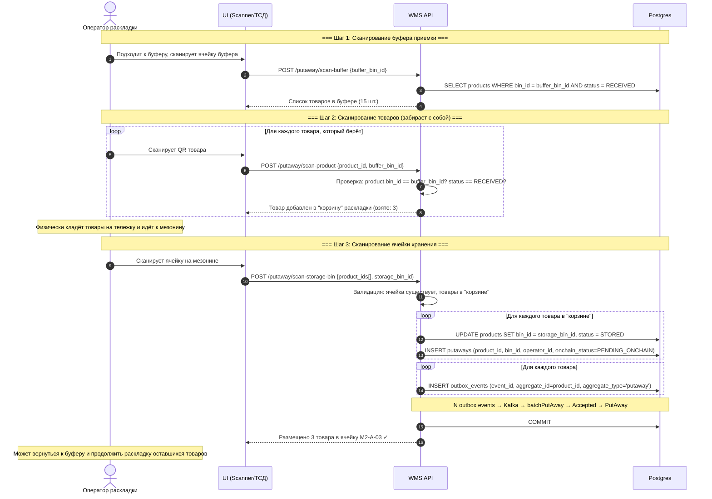
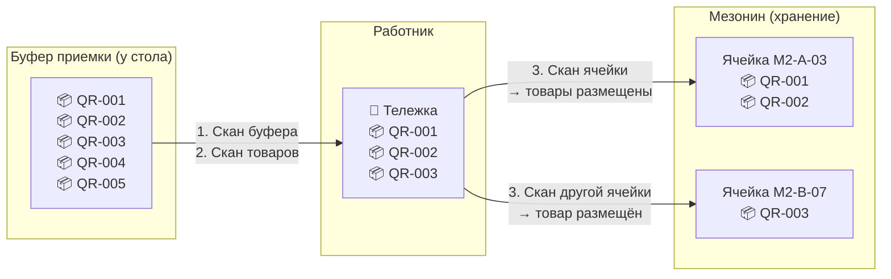
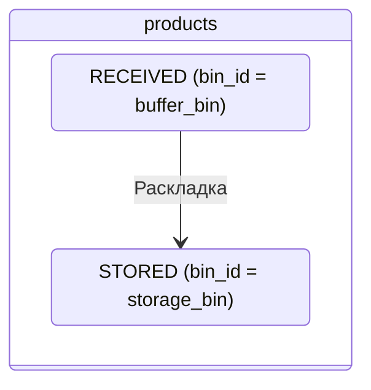
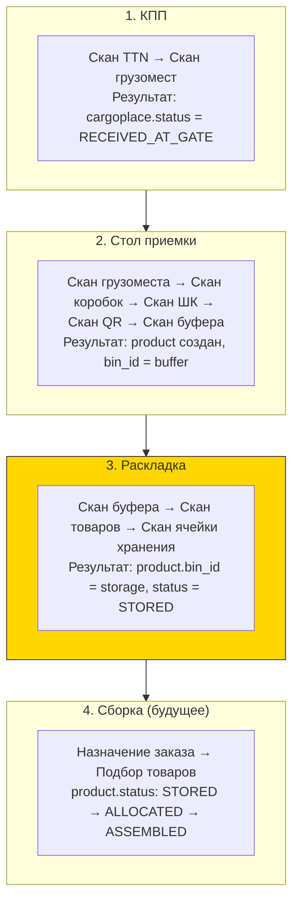

# Раскладка (Putaway)

## Суть

Перенос товаров из буфера приемки в ячейки хранения на мезонине. Работник физически забирает товары из буфера и раскладывает по полкам.

**Ключевое:** в MVP нет системных ограничений на то, куда класть товар. Работник сам решает.

## Диаграмма последовательности

## Физический процесс (простая схема)

## Что меняется в БД

| Таблица | Операция | Что меняется |
|---------|----------|-------------|
| `products` | UPDATE | bin_id: buffer → storage, status: RECEIVED → STORED |
| `putaways` | INSERT | Запись о размещении (product_id, bin_id, operator_id) |
| `outbox_events` | INSERT | 1 event per product (aggregate_id=product_id, aggregate_type='putaway') |

## Почему "нет системных ограничений"

В MVP система **не проверяет**:
- Вместимость ячейки (`bins.volume` vs сумма `skus.volume`)
- Совместимость SKU в одной ячейке
- Принадлежность ячейки к определённой зоне
- Максимальный вес полки

Работник опирается на своё знание склада. В post-MVP можно добавить правила размещения (putaway rules).

## Связь с предыдущими этапами

