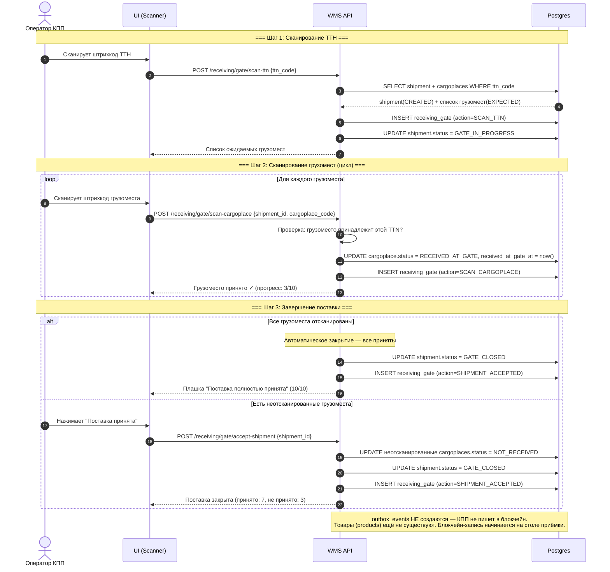
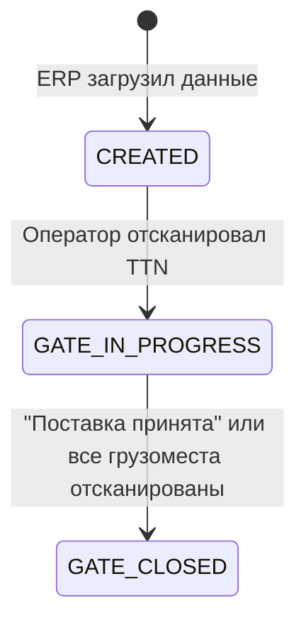
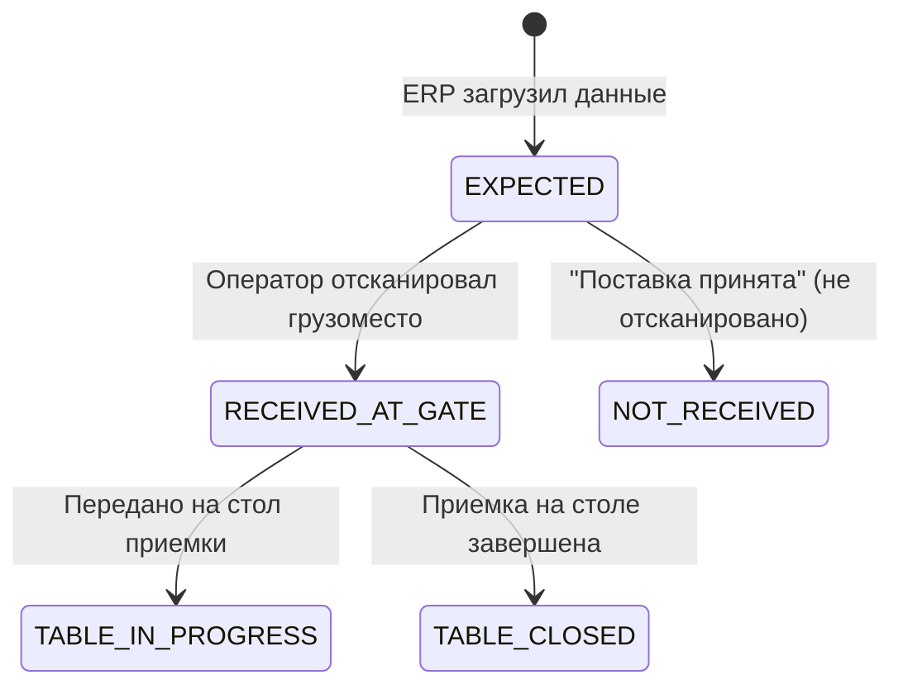

# Приемка на КПП (воротах)

## Суть

Принимаем грузоместа в рамках конкретной поставки (TTN). Грузоместа и их привязка к TTN уже известны из ERP и загружены в БД до начала сканирования.

## Диаграмма последовательности

## Состояния сущностей

### inbound_shipments.status

### cargoplaces.status

## Какие таблицы затрагиваются

| Таблица | Операция | Что меняется |
|---------|----------|-------------|
| `inbound_shipments` | UPDATE | status: CREATED → GATE_IN_PROGRESS → GATE_CLOSED |
| `cargoplaces` | UPDATE | status: EXPECTED → RECEIVED_AT_GATE / NOT_RECEIVED |
| `receiving_gate` | INSERT | Лог каждого действия (append-only) |
| `outbox_events` | — | **НЕ создаётся** (КПП не пишет в блокчейн, товары ещё не существуют) |
