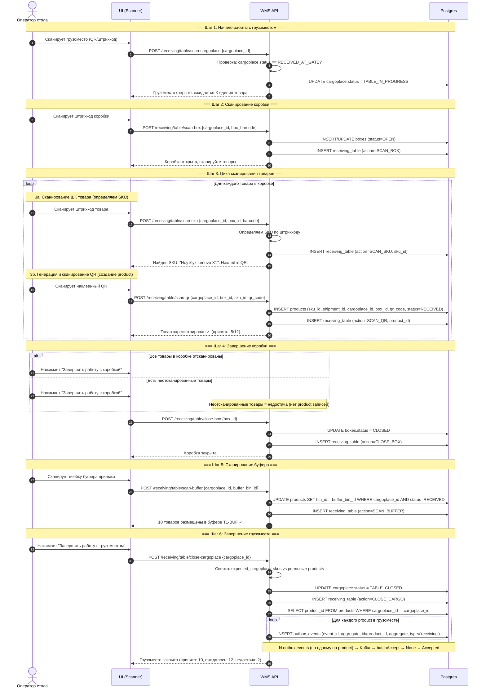
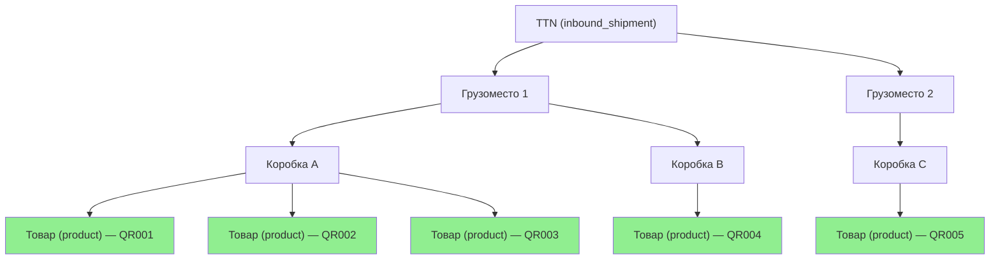

# Приемка на столе

## Суть

Работа с содержимым грузоместа: вскрываем, сканируем коробки, сканируем товары по штрихкоду (определяем SKU), клеим и сканируем уникальный QR, затем отправляем всё в буфер.

**Важно:** именно на этом этапе создаётся `product` — запись о реально существующей единице товара. До этого были только ожидаемые количества (`expected_cargoplace_skus`).

## Диаграмма последовательности



## Структура вложенности



## Сверка недостачи

```
expected_cargoplace_skus: SKU-A × 5, SKU-B × 3  (итого 8 ожидается)
products (реально создано): SKU-A × 4, SKU-B × 3  (итого 7 принято)
→ Недостача: SKU-A × 1
```

Недостача фиксируется **неявно** — если `expected_qty > count(products)` для данного SKU в данном грузоместе.

## Какие таблицы затрагиваются

| Таблица | Операция | Что меняется |
|---------|----------|-------------|
| `cargoplaces` | UPDATE | status: RECEIVED_AT_GATE → TABLE_IN_PROGRESS → TABLE_CLOSED |
| `boxes` | INSERT/UPDATE | Создание коробки (OPEN), закрытие (CLOSED) |
| `products` | INSERT | **Создаётся при SCAN_QR** — единица товара с уникальным QR |
| `products` | UPDATE | bin_id заполняется при SCAN_BUFFER |
| `receiving_table` | INSERT | Лог каждого действия (append-only) |
| `expected_cargoplace_skus` | READ | Для сверки ожидаемого vs фактического |
| `outbox_events` | INSERT | **N events** при CLOSE_CARGO (по одному на product, aggregate_id=product_id, aggregate_type='receiving') |
