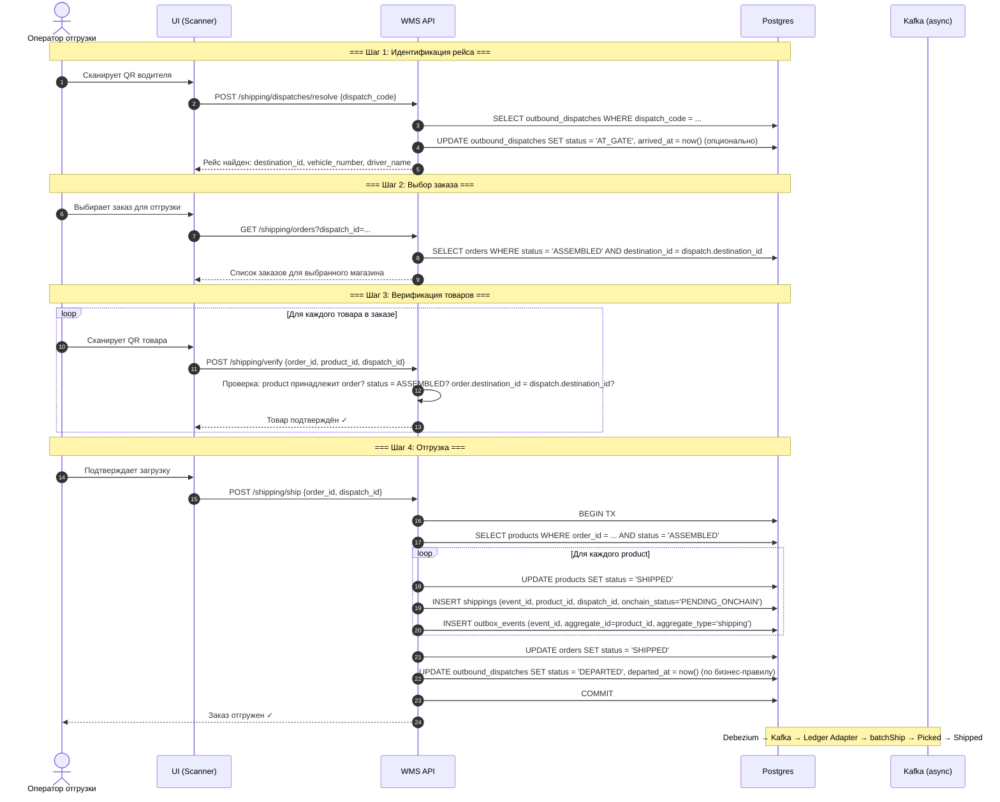
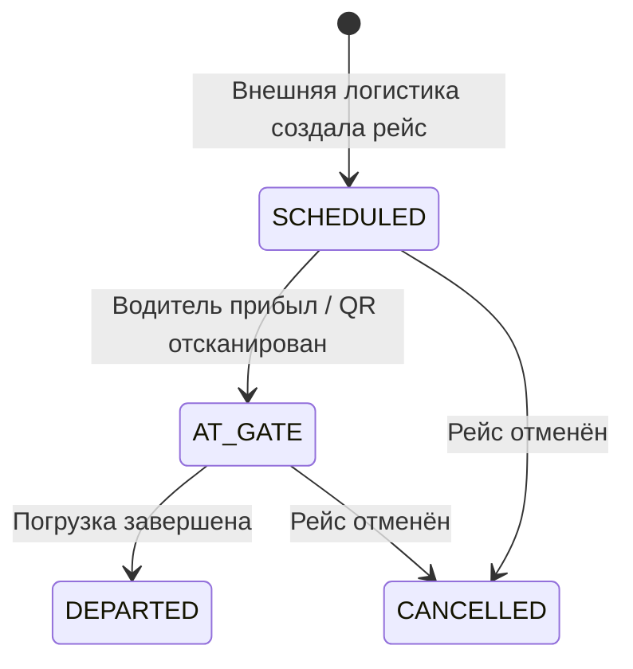
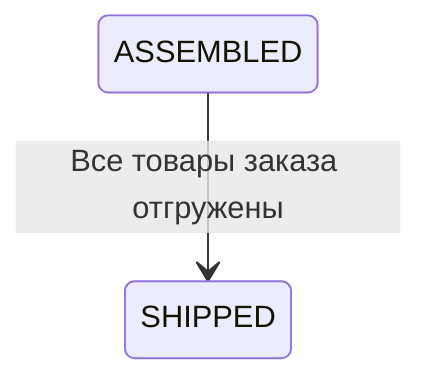
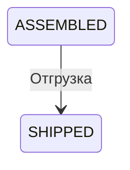

# Отгрузка (Shipping)

## Суть

Финальный этап: собранные товары передаются водителю и покидают склад.

**Ключевое в новой схеме:**

- отгрузка привязана к заранее созданному `outbound_dispatch`
- оператор находит рейс по `dispatch_code` (QR водителя)
- рейс, заказ и буфер отгрузки должны сходиться по одному `destination_id`
- в `shippings` хранится ссылка на `dispatch_id`, а номер машины берется из `outbound_dispatches`

## Диаграмма последовательности



## Состояния сущностей

### outbound_dispatches.status



### orders.status (в контексте отгрузки)



### products.status (в контексте отгрузки)



## Какие таблицы затрагиваются

| Таблица | Операция | Что меняется |
|---------|----------|-------------|
| `outbound_dispatches` | SELECT / UPDATE | Поиск по `dispatch_code`, статусы `SCHEDULED → AT_GATE → DEPARTED` |
| `orders` | SELECT / UPDATE | Фильтр по `destination_id`, статус `ASSEMBLED → SHIPPED` |
| `products` | UPDATE | `status: ASSEMBLED → SHIPPED` |
| `shippings` | INSERT | Запись об отгрузке с `dispatch_id` |
| `outbox_events` | INSERT | N events (1 per product, `aggregate_type='shipping'`) |

## Outbox events

```sql
-- При POST /shipping/ship, для КАЖДОГО product в заказе:
INSERT INTO outbox_events (event_id, aggregate_id, aggregate_type, event_type, payload_hash)
VALUES (
  shipping.event_id,
  shipping.product_id,
  'shipping',
  'wms.shipping.v1',
  sha256(...)
);
```

**Блокчейн:** `batchShip(eventIds[], itemIds[])` → переход `Picked → Shipped`.

## Валидация destination

В исходящем потоке `destination_id` становится сквозным ключом:

- `orders.destination_id` говорит, куда должен уехать заказ
- `bins.destination_id` привязывает `SHIPPING_BUFFER` к магазину
- `outbound_dispatches.destination_id` говорит, для какого магазина приехала машина
- `shippings.dispatch_id` фиксирует, в какой рейс реально погрузили товар

За счет этого оператор и backend могут валидировать `order ↔ shipping_buffer ↔ dispatch` в одном контуре.
