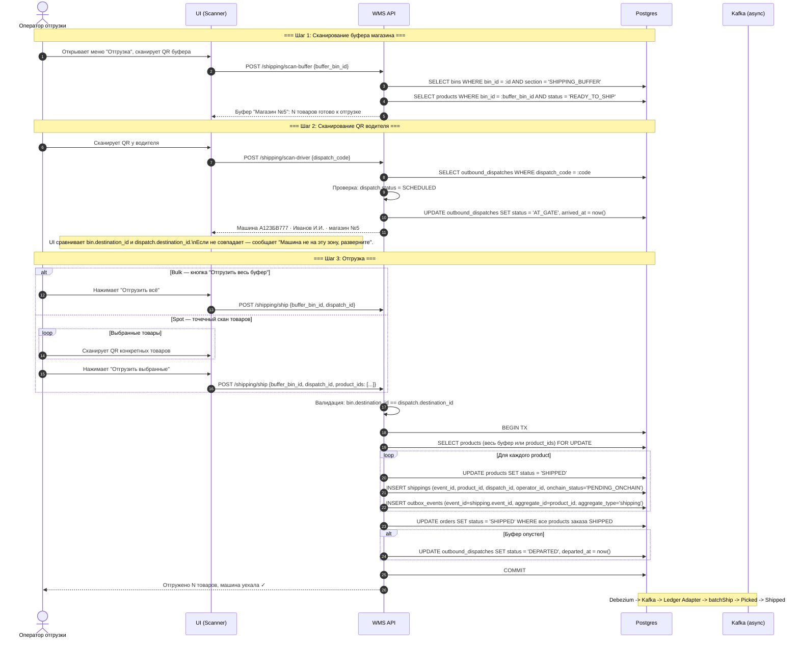
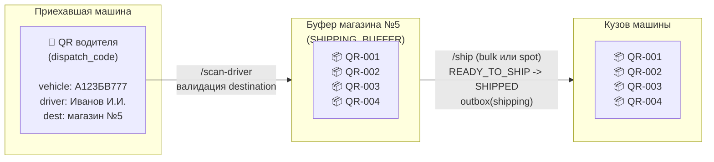
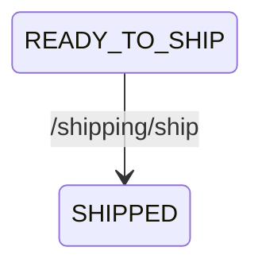
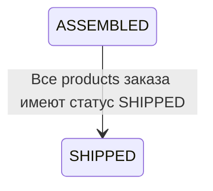
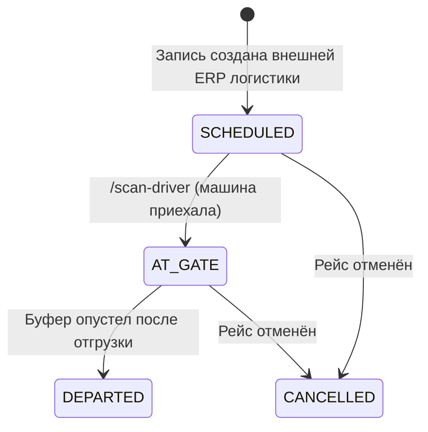
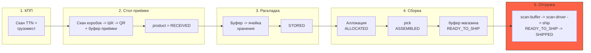
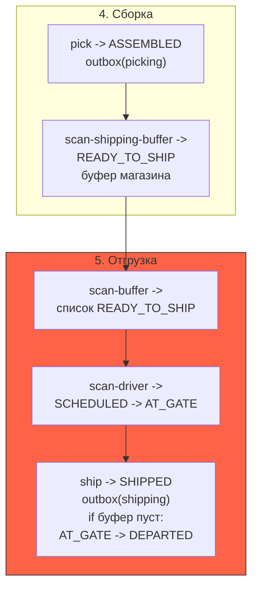

# Отгрузка (Shipping)

## Суть

Финальный этап: приехавшая по расписанию машина забирает товары из буфера магазина. Оператор сканирует буфер и QR водителя, после чего отгружает весь буфер или выбранные товары, если не всё влезает. После отгрузки товар покидает склад.

**Ключевое:**

- Отгрузка работает с **буфером магазина** (`SHIPPING_BUFFER` bin), а не с конкретным `order_id`. Все товары со статусом `READY_TO_SHIP` в этом буфере считаются готовыми к загрузке.
- QR водителя содержит `dispatch_code` — ссылку на заранее созданную запись `outbound_dispatches` (машина, водитель, магазин назначения). Эту запись создаёт внешняя ERP/логистика, аналогично TTN на приёмке.
- Рейс, заказ и буфер отгрузки должны сходиться по одному `destination_id`.
- В `shippings` хранится ссылка на `dispatch_id`; номер машины берётся из `outbound_dispatches`.
- Два режима: **bulk** (весь буфер одной кнопкой) и **spot** (точечный скан конкретных товаров).
- Outbox event создаётся на каждый отгруженный product (`aggregate_type = 'shipping'`) -> финальный переход контракта `Picked -> Shipped`.

## Диаграмма последовательности



## Физический процесс



## Состояния сущностей

### products.status (в контексте отгрузки)



### orders.status (в контексте отгрузки)



### outbound_dispatches.status



## Два режима отгрузки

### Bulk — «Отгрузить весь буфер» (по умолчанию)

В запросе `product_ids` отсутствует или пуст. Бэкенд берёт все products буфера со статусом `READY_TO_SHIP` и отгружает их одной транзакцией.

```json
POST /shipping/ship
{
  "buffer_bin_id": "uuid-buffer-shop-5",
  "dispatch_id":  "uuid-dispatch"
}
```

Это основной сценарий: «приехала машина — забирает всё, что мы для неё собрали».

### Spot — «Отгрузить выбранные»

На случай, когда не всё влезает в кузов (праздники, крупный товар, ограничение по объёму). Оператор сканирует QR конкретных товаров, которые реально загружает в машину.

```json
POST /shipping/ship
{
  "buffer_bin_id": "uuid-buffer-shop-5",
  "dispatch_id":  "uuid-dispatch",
  "product_ids":  ["uuid-1", "uuid-2", "uuid-3"]
}
```

Бэкенд валидирует, что каждый `product_ids[i]` действительно лежит в этом буфере со статусом `READY_TO_SHIP`. Оставшиеся в буфере товары ждут следующую машину.

## Что меняется в БД

| Таблица | Операция | Что меняется |
|---------|----------|--------------|
| `bins` | SELECT | Проверяется `section = 'SHIPPING_BUFFER'` и читается `destination_id` |
| `products.status` | UPDATE | `READY_TO_SHIP -> SHIPPED` |
| `shippings` | INSERT | Запись об отгрузке: `event_id`, `product_id`, `dispatch_id`, `operator_id`, `shipped_at`, `onchain_status = PENDING_ONCHAIN` |
| `orders.status` | UPDATE | `ASSEMBLED -> SHIPPED`, когда все products заказа `SHIPPED` |
| `outbound_dispatches` | SELECT / UPDATE | Поиск по `dispatch_code`, статусы `SCHEDULED -> AT_GATE -> DEPARTED` |
| `outbox_events` | INSERT | N events, 1 per product, `aggregate_type = 'shipping'` |

## Outbox events

```sql
-- При POST /shipping/ship, для каждого отгруженного product в одной транзакции:
INSERT INTO outbox_events (event_id, aggregate_id, aggregate_type, event_type, payload_hash)
VALUES (
  shipping.event_id,
  shipping.product_id,
  'shipping',
  'wms.shipping.v1',
  sha256(payload)
);
```

**Блокчейн:** `batchShip(eventIds[], itemIds[])` -> переход `Picked -> Shipped`.

Это **финальный переход** в FSM контракта. После `Shipped` статус на блокчейне не меняется.

## Валидации

| Условие | Ошибка |
|---------|--------|
| `/scan-buffer`: `bin.section != 'SHIPPING_BUFFER'` | `BIN_NOT_SHIPPING_BUFFER` |
| `/scan-buffer`: bin не найден | `BIN_NOT_FOUND` |
| `/scan-buffer`: в буфере нет товаров `READY_TO_SHIP` | `BUFFER_EMPTY` |
| `/scan-driver`: `dispatch_code` не найден | `DISPATCH_NOT_FOUND` |
| `/scan-driver`: `dispatch.status = DEPARTED` | `DISPATCH_ALREADY_DEPARTED` |
| `/scan-driver`: `dispatch.status = AT_GATE` | `DISPATCH_ALREADY_AT_GATE` (опционально — уже сканировали этот QR) |
| `/ship`: `bin.destination_id != dispatch.destination_id` | `DESTINATION_MISMATCH` |
| `/ship`: `dispatch.status != AT_GATE` | `DISPATCH_NOT_AT_GATE` |
| `/ship`: один из `product_ids` не в буфере / не `READY_TO_SHIP` | `PRODUCT_NOT_IN_BUFFER` |
| `/ship`: буфер пуст в bulk-режиме | `BUFFER_EMPTY` |

`DESTINATION_MISMATCH` — главная защита от ошибки «не та машина на воротах». Сравниваются два `destination_id`: у буфера и у dispatch. Если не совпадает — ни один товар не отгружается.

## Ошибки блокчейна

В соответствии с решением на встрече: **не детализируем** типы on-chain ошибок. Если транзакция ревертнулась, `onchain_events.status = FAILED`, оператор видит общий индикатор «Транзакция не подтверждена. Обратитесь к администратору».

Подробная диагностика (причина реверта, failed eventId) доступна админу через `onchain_events` и логи Ledger Adapter. Оператор на воротах в реальном времени не обязан это разбирать.

## Валидация destination

В исходящем потоке `destination_id` становится сквозным ключом:

- `orders.destination_id` говорит, куда должен уехать заказ.
- `bins.destination_id` привязывает `SHIPPING_BUFFER` к магазину.
- `outbound_dispatches.destination_id` говорит, для какого магазина приехала машина.
- `assembly_tasks.destination_id` фиксирует магазин на уровне задачи сборки.
- `shippings.dispatch_id` фиксирует, в какой рейс реально погрузили товар.

За счёт этого backend может валидировать `order -> shipping_buffer -> dispatch` в одном контуре.

## Связь с процессом



## On-chain FSM (параллельно)

```text
off-chain:  RECEIVED   STORED   ASSEMBLED/READY_TO_SHIP   SHIPPED
            ↓          ↓        ↓                         ↓
on-chain:   Accepted   PutAway  Picked                    Shipped
```

**4 on-chain перехода** на весь жизненный цикл:

| Off-chain операция | Outbox aggregate_type | Kafka topic | Контракт | On-chain переход |
|--------------------|----------------------|-------------|----------|------------------|
| Стол приёмки (close-cargoplace) | `receiving` | `wms.receiving.v1` | `batchAccept` | `None -> Accepted` |
| Раскладка | `putaway` | `wms.putaway.v1` | `batchPutAway` | `Accepted -> PutAway` |
| Сборка — pick | `picking` | `wms.picking.v1` | `batchPick` | `PutAway -> Picked` |
| **Отгрузка — ship** | `shipping` | `wms.shipping.v1` | `batchShip` | **`Picked -> Shipped`** |

`scan-shipping-buffer` (физическое перемещение в буфер магазина) — off-chain only, outbox не создаётся.

## Связь со сборкой


