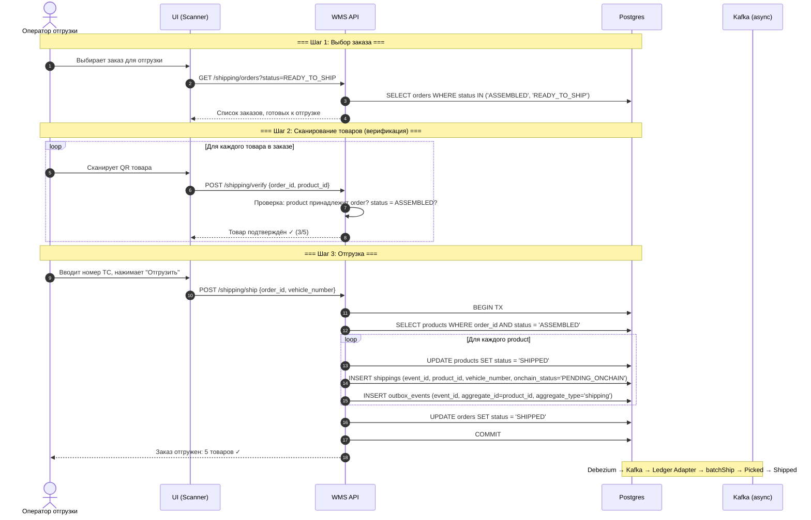
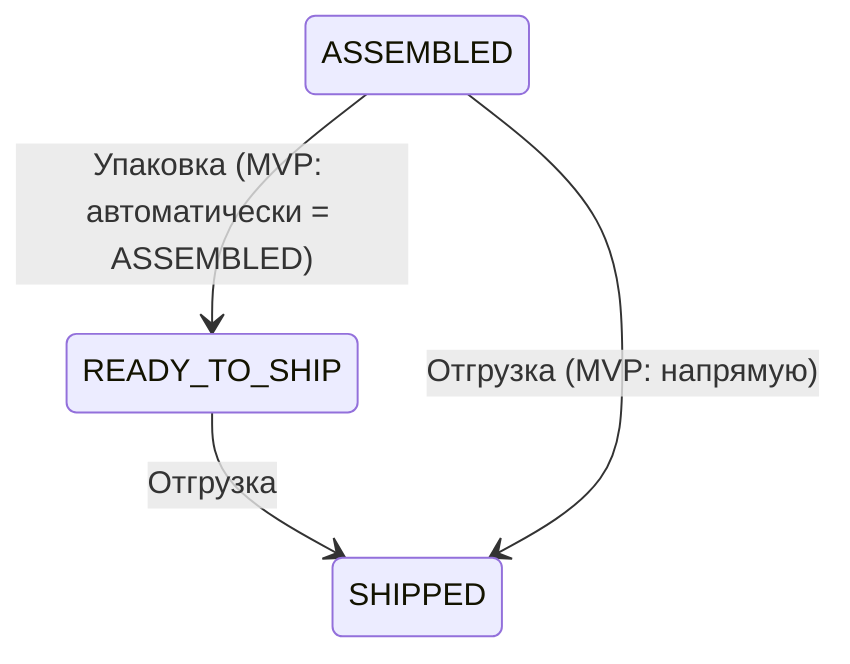
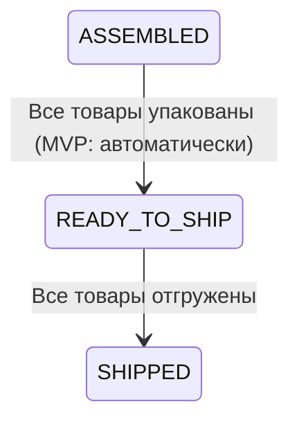

# Отгрузка (Shipping)

## Суть

Финальный этап: собранные товары передаются курьеру / загружаются в транспорт. После отгрузки товар покидает склад.

**Ключевое:** отгрузка работает на уровне заказа — все товары заказа отгружаются одновременно. Outbox event создаётся **по одному на каждый product**.

## Диаграмма последовательности



## Состояния сущностей

### products.status (в контексте отгрузки)


### orders.status (в контексте отгрузки)


## Какие таблицы затрагиваются

| Таблица | Операция | Что меняется |
|---------|----------|-------------|
| `products` | UPDATE | status: ASSEMBLED → SHIPPED |
| `shippings` | INSERT | Запись об отгрузке (product_id, vehicle_number, onchain_status) |
| `orders` | UPDATE | status → SHIPPED (когда все products отгружены) |
| `outbox_events` | INSERT | N events (1 per product, aggregate_type='shipping') |

## Outbox events

```sql
-- При POST /shipping/ship, для КАЖДОГО product в заказе (одна TX):
INSERT INTO outbox_events (event_id, aggregate_id, aggregate_type, event_type, payload_hash)
VALUES (
  shipping.event_id,       -- тот же event_id что и в shippings
  shipping.product_id,     -- product_id → Kafka key → itemId в контракте
  'shipping',              -- → topic: wms.shipping.v1
  'wms.shipping.v1',
  sha256(...)
);
```

**Блокчейн:** `batchShip(eventIds[], itemIds[])` → переход `Picked → Shipped`.

Это **финальный переход** в FSM контракта. После `Shipped` статус товара на блокчейне не меняется.

## Полный жизненный цикл товара

```mermaid
flowchart LR
    subgraph GATE["1. КПП"]
        G["Скан TTN + грузомест"]
    end

    subgraph TABLE["2. Стол приёмки"]
        T["Скан коробок → Скан ШК → QR → Буфер"]
        T2["product создан, status=RECEIVED"]
    end

    subgraph PUTAWAY["3. Раскладка"]
        P["Из буфера → ячейка хранения"]
        P2["status=STORED"]
    end

    subgraph ASSEMBLY["4. Сборка"]
        A["Аллокация → Подбор с полки"]
        A2["status=ASSEMBLED"]
    end

    subgraph SHIPPING["5. Отгрузка"]
        S["Верификация → Отгрузка"]
        S2["status=SHIPPED"]
    end

    G --> T --> T2 --> P --> P2 --> A --> A2 --> S --> S2

    style SHIPPING fill:#FF6347,stroke:#333
```



## Blockchain FSM (параллельно)

```
On-chain:  None → Accepted → PutAway → Picked → Shipped
                     ↑           ↑         ↑        ↑
Off-chain: RECEIVED  STORED   ASSEMBLED  SHIPPED
           (table)  (putaway)  (pick)    (ship)
```

Каждый переход off-chain создаёт outbox event → Kafka → Ledger Adapter → on-chain переход.
