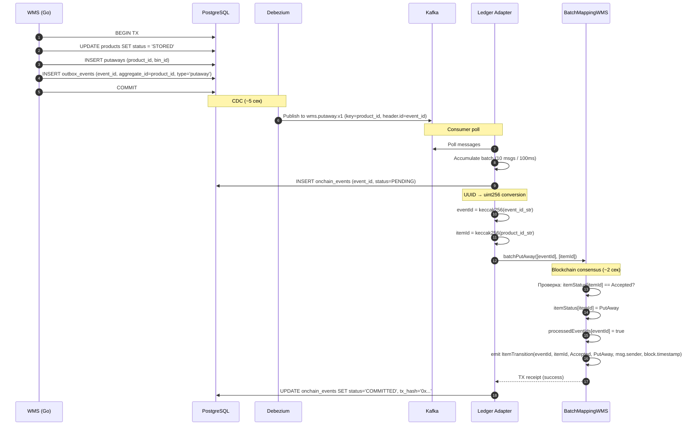

# Маппинг: WMS → Блокчейн

**Версия:** 1.0
**Дата:** 2026-03-31

Этот документ описывает, как каждая WMS-операция превращается в запись на блокчейне. Полный путь: бизнес-операция → outbox → Debezium → Kafka → Ledger Adapter → BatchMappingWMS.

---

## Общая схема

```mermaid
flowchart LR
    subgraph WMS["WMS (Go)"]
        OP["Бизнес-операция"]
        OB["outbox_events"]
    end

    subgraph CDC["CDC"]
        DZ["Debezium"]
    end

    subgraph MQ["Message Queue"]
        KF["Kafka topics"]
    end

    subgraph LA["Ledger Adapter (Go)"]
        BATCH["Batch accumulator"]
        TX["TX builder"]
    end

    subgraph BC["Blockchain"]
        SC["BatchMappingWMS"]
        LOG["Event logs"]
    end

    OP -->|"INSERT в одной TX"| OB
    OB -->|"WAL / CDC"| DZ
    DZ -->|"publish"| KF
    KF -->|"consume"| BATCH
    BATCH -->|"flush (10 msgs / 100ms)"| TX
    TX -->|"RPC call"| SC
    SC -->|"emit"| LOG
```



---

## Маппинг по этапам

### 1. Приёмка на КПП

| Аспект | Значение |
|--------|---------|
| **Outbox event** | НЕ создаётся |
| **Причина** | Товары (products) ещё не существуют. КПП работает с грузоместами |
| **Блокчейн** | Ничего |

---

### 2. Приёмка на столе

| Аспект | Значение |
|--------|---------|
| **Триггер** | POST /receiving/table/close-cargoplace |
| **Что происходит в WMS** | Закрытие грузоместа: сверка expected vs actual |
| **Outbox events** | N штук (по 1 на каждый product в грузоместе) |
| **aggregate_id** | product_id |
| **aggregate_type** | `receiving` |
| **event_type** | `wms.receiving.v1` |
| **Kafka topic** | `wms.receiving.v1` |
| **Kafka key** | product_id (UUID string) |
| **Контракт** | `batchAccept(eventIds[], itemIds[])` |
| **On-chain переход** | None → Accepted |
| **Event log** | `ItemTransition(eventId, itemId, None, Accepted, actor, timestamp)` |

**Пример:** грузоместо с 10 товарами → 10 outbox events → Kafka → batch=10 → 1 транзакция `batchAccept` → 10 `ItemTransition` events в блокчейне.

---

### 3. Раскладка

| Аспект | Значение |
|--------|---------|
| **Триггер** | POST /putaway/scan-storage-bin |
| **Что происходит в WMS** | Товары перемещены из буфера в ячейку хранения |
| **Outbox events** | N штук (по 1 на каждый product в «корзине») |
| **aggregate_id** | product_id |
| **aggregate_type** | `putaway` |
| **event_type** | `wms.putaway.v1` |
| **Kafka topic** | `wms.putaway.v1` |
| **Kafka key** | product_id (UUID string) |
| **Контракт** | `batchPutAway(eventIds[], itemIds[])` |
| **On-chain переход** | Accepted → PutAway |
| **Event log** | `ItemTransition(eventId, itemId, Accepted, PutAway, actor, timestamp)` |

---

### 4. Сборка (подбор)

| Аспект | Значение |
|--------|---------|
| **Триггер** | POST /assembly/pick |
| **Что происходит в WMS** | Оператор физически подобрал товар с полки |
| **Outbox events** | 1 штука (за каждый pick — 1 product) |
| **aggregate_id** | product_id |
| **aggregate_type** | `picking` |
| **event_type** | `wms.picking.v1` |
| **Kafka topic** | `wms.picking.v1` |
| **Kafka key** | product_id (UUID string) |
| **Контракт** | `batchPick(eventIds[], itemIds[])` |
| **On-chain переход** | PutAway → Picked |
| **Event log** | `ItemTransition(eventId, itemId, PutAway, Picked, actor, timestamp)` |

**Важно:** аллокация (STORED → ALLOCATED) **не создаёт** outbox event. Блокчейн видит только физические операции, не системные назначения.

---

### 5. Отгрузка

| Аспект | Значение |
|--------|---------|
| **Триггер** | POST /shipping/ship |
| **Что происходит в WMS** | Все товары заказа отгружены в транспортное средство |
| **Outbox events** | N штук (по 1 на каждый product в заказе) |
| **aggregate_id** | product_id |
| **aggregate_type** | `shipping` |
| **event_type** | `wms.shipping.v1` |
| **Kafka topic** | `wms.shipping.v1` |
| **Kafka key** | product_id (UUID string) |
| **Контракт** | `batchShip(eventIds[], itemIds[])` |
| **On-chain переход** | Picked → Shipped |
| **Event log** | `ItemTransition(eventId, itemId, Picked, Shipped, actor, timestamp)` |

Это **финальный** переход. После Shipped статус на блокчейне не меняется.

---

## Сводная таблица

| Этап WMS | aggregate_type | Kafka topic | Batch-функция | FSM переход |
|----------|---------------|-------------|---------------|-------------|
| КПП | — | — | — | — |
| Стол приёмки | `receiving` | `wms.receiving.v1` | `batchAccept` | None → Accepted |
| Раскладка | `putaway` | `wms.putaway.v1` | `batchPutAway` | Accepted → PutAway |
| Сборка | `picking` | `wms.picking.v1` | `batchPick` | PutAway → Picked |
| Отгрузка | `shipping` | `wms.shipping.v1` | `batchShip` | Picked → Shipped |

---

## Конвертация идентификаторов

```
UUID (PostgreSQL)  →  uint256 (Solidity)
─────────────────────────────────────────
event_id           →  uint256(keccak256(bytes("550e8400-e29b-41d4-a716-446655440000")))
product_id         →  uint256(keccak256(bytes("7c9e6679-7425-40de-944b-e07fc1f90ae7")))
```

Конвертация детерминистична и однонаправлена. Один UUID всегда даёт один uint256. Из uint256 восстановить UUID нельзя.

---

## Обработка ошибок

### Дубликаты

Двойная защита:

1. **Ledger Adapter:** проверяет `onchain_events.event_id` перед обработкой
2. **Контракт:** `processedEventIds[eventId] == true` → revert `DuplicateEventId`

### Неверный порядок переходов

Контракт проверяет FSM: нельзя вызвать `batchPutAway` для товара в статусе `None` (нужен сначала `batchAccept`). Revert всей batch-транзакции.

**Митигация:** Kafka key = product_id → все события одного товара в одной партиции → ordering гарантирован.

### Невалидный item в batch

Один невалидный item → **вся транзакция** ревертится (атомарность EVM).

**Митигация:**
1. Ledger Adapter валидирует items перед отправкой
2. Невалидные → DLQ (`wms.dlq.v1`)
3. Retry без невалидных items

### Сбой блокчейна / RPC

```
TX отправлена, нет receipt
→ Ledger Adapter ждёт с экспоненциальным backoff
→ Запись в onchain_events остаётся в статусе SENT
→ После получения receipt → COMMITTED или FAILED
```

---

## Диаграмма: полный путь одного события



---

## Аудит: как проверить целостность

### Шаг 1: найти on-chain записи товара

```sql
SELECT oe.event_id, oe.tx_hash, oe.status, oe.aggregate_type, oe.created_at
FROM onchain_events oe
JOIN outbox_events ob ON ob.event_id = oe.event_id
WHERE ob.aggregate_id = :product_id
  AND oe.status = 'COMMITTED'
ORDER BY oe.created_at;
```

Ожидаемый результат: 4 записи (receiving, putaway, picking, shipping).

### Шаг 2: проверить on-chain данные

Взять `tx_hash` → запросить receipt → декодировать `ItemTransition` events → сверить `itemId` и `status` с PostgreSQL.

### Шаг 3: проверить порядок

On-chain timestamps должны быть монотонно возрастающими: Accepted < PutAway < Picked < Shipped. Расхождение = индикатор подмены данных в БД.
