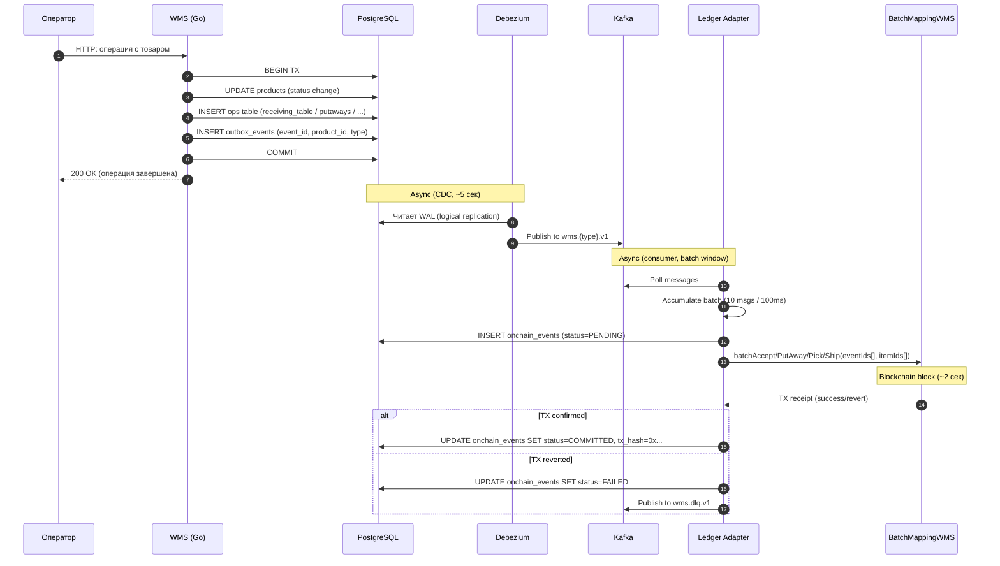

# Контракт данных: WMS ↔ Kafka ↔ Ledger Adapter ↔ Blockchain

**Дата:** 2026-03-30
**Статус:** согласовано, готово к реализации

---

## Обзор

Этот документ фиксирует формат данных на каждом этапе пайплайна:

```
WMS (Go) → outbox_events (PG) → Debezium → Kafka → Ledger Adapter (Go) → BatchMappingWMS (Solidity)
```

Цель: обе стороны (WMS и Ledger Adapter) могут реализовываться **независимо**, опираясь на этот контракт.

---

## 1. outbox_events (WMS → PostgreSQL)

WMS пишет в `outbox_events` **в той же транзакции**, что и бизнес-операцию.

```sql
INSERT INTO outbox_events (event_id, aggregate_id, aggregate_type, event_type, payload_hash)
VALUES (
  gen_random_uuid(),    -- уникальный ID события
  :product_id,          -- ВСЕГДА product_id (для всех 4 процессов)
  :aggregate_type,      -- lowercase: receiving / putaway / picking / shipping
  :event_type,          -- wms.{aggregate_type}.v1
  :payload_hash         -- sha256(JSON payload) — для integrity check
);
```

### Правило: 1 outbox event = 1 product

| Процесс | Когда создаётся outbox event | aggregate_id | aggregate_type |
|---------|------------------------------|-------------|----------------|
| Приёмка на столе | `CLOSE_CARGO` — по одному event на каждый product в грузоместе | product_id | `receiving` |
| Раскладка | При размещении товара в ячейку | product_id | `putaway` |
| Сборка | При подборе товара (status → DONE) | product_id | `picking` |
| Отгрузка | При отгрузке товара | product_id | `shipping` |

**Приёмка на КПП (receiving_gate):** outbox events **НЕ создаются**. КПП — логистическая операция, товары (`products`) ещё не существуют.

### Значения aggregate_type (СТРОГО lowercase)

```
receiving   →  topic: wms.receiving.v1   →  контракт: batchAccept
putaway     →  topic: wms.putaway.v1     →  контракт: batchPutAway
picking     →  topic: wms.picking.v1     →  контракт: batchPick
shipping    →  topic: wms.shipping.v1    →  контракт: batchShip
```

Kafka topic формируется Debezium по формуле: `wms.${aggregate_type}.v1`. Если aggregate_type написан в другом регистре или с другим именем — роутинг сломается.

### payload_hash

SHA-256 хеш JSON-представления бизнес-данных. Формат JSON не стандартизируется — хеш используется только для integrity/dedup на уровне аудита. Ledger Adapter **не парсит** payload_hash.

---

## 2. Debezium EventRouter → Kafka

Конфигурация: `deploy/debezium/connectors/postgres-connector.json`

Debezium читает WAL PostgreSQL, ловит INSERT в `outbox_events` и трансформирует через EventRouter:

### Kafka message format

```
Topic:   wms.{aggregate_type}.v1       (из aggregate_type)
Key:     aggregate_id                   (product_id как строка UUID)
Value:   payload_hash                   (строка SHA-256 хеша)
Headers:
  id:    event_id                       (строка UUID)
```

### Маппинг полей outbox_events → Kafka

| Поле outbox_events | Куда попадает в Kafka | Назначение |
|--------------------|-----------------------|------------|
| `aggregate_type` | Topic routing: `wms.${value}.v1` | Определяет какой batch-функции вызвать |
| `aggregate_id` | Message key | product_id → itemId для контракта |
| `payload_hash` | Message value | Integrity check (Ledger Adapter не использует) |
| `event_id` | Header `id` | eventId для контракта + idempotency |
| `event_type` | Header (опционально) | Не используется в routing |

### Партиционирование

Kafka key = `product_id`. Все события одного товара попадают в одну партицию → **ordering гарантирован** для одного товара. Это важно: нельзя получить `PutAway` раньше `Accept` для одного itemId.

---

## 3. Ledger Adapter: чтение из Kafka

Ledger Adapter — Kafka consumer, подписан на 4 топика:
- `wms.receiving.v1`
- `wms.putaway.v1`
- `wms.picking.v1`
- `wms.shipping.v1`

### Что Ledger Adapter извлекает из сообщения

```go
// Из Kafka message:
eventIDStr := message.Headers["id"]       // UUID string
productIDStr := string(message.Key)        // UUID string (product_id)
topic := message.Topic                     // определяет batch-функцию

// Конвертация в uint256 для контракта:
eventID  := uint256(keccak256([]byte(eventIDStr)))
itemID   := uint256(keccak256([]byte(productIDStr)))
```

### Batch accumulation

Ledger Adapter накапливает сообщения и группирует по topic:

```
Условие flush:
  - Размер batch ≥ 10 сообщений (configurable)
  - ИЛИ timeout ≥ 100ms с момента первого сообщения в batch

Группировка по topic:
  wms.receiving.v1 → batchAccept(eventIds[], itemIds[])
  wms.putaway.v1   → batchPutAway(eventIds[], itemIds[])
  wms.picking.v1   → batchPick(eventIds[], itemIds[])
  wms.shipping.v1  → batchShip(eventIds[], itemIds[])
```

### Idempotency

Перед обработкой Ledger Adapter проверяет:
```sql
SELECT 1 FROM onchain_events WHERE event_id = :event_id
```
Если запись существует — сообщение пропускается (уже обработано или в процессе).

---

## 4. Конвертация UUID → uint256

**Единый стандарт для всего проекта:**

```
uint256(keccak256(bytes(uuid_string)))
```

Где `uuid_string` — каноническая строковая форма UUID (например `"550e8400-e29b-41d4-a716-446655440000"`).

Применяется к:
- `event_id` → `eventId` (параметр контракта)
- `product_id` (через `aggregate_id`) → `itemId` (параметр контракта)

Конвертация **детерминистична** и **однонаправлена** (из uint256 нельзя восстановить UUID, но один UUID всегда даёт один uint256).

---

## 5. onchain_events (Ledger Adapter → PostgreSQL)

После отправки batch-транзакции Ledger Adapter обновляет `onchain_events`:

### Жизненный цикл записи

```
1. Kafka message получено     → INSERT (event_id, aggregate_type, status=PENDING)
2. TX отправлена в блокчейн   → UPDATE SET tx_hash='0x...', status=SENT
3. TX подтверждена (receipt)   → UPDATE SET status=COMMITTED
4. TX ревертнулась             → UPDATE SET status=FAILED, error_message='...'
```

### Batch: один tx_hash → несколько event_id

При batch=10 одна транзакция содержит 10 items. Все 10 записей в `onchain_events` получают **один и тот же** `tx_hash`. Это корректно и ожидаемо.

### Таблица onchain_events

```sql
-- Существующая схема (миграция 0001), изменений НЕ требуется
CREATE TABLE public.onchain_events (
  id             bigserial PRIMARY KEY,
  event_id       uuid NOT NULL UNIQUE,
  aggregate_type text NOT NULL,
  tx_hash        text,
  status         onchain_event_status NOT NULL DEFAULT 'PENDING',
  error_message  text,
  created_at     timestamptz NOT NULL DEFAULT now(),
  updated_at     timestamptz NOT NULL DEFAULT now()
);
```

---

## 6. BatchMappingWMS (Ledger Adapter → Blockchain)

### Контракт (Solidity)

```solidity
contract BatchMappingWMS {
    enum Status { None, Accepted, PutAway, Picked, Shipped }

    mapping(uint256 => Status) public itemStatus;
    mapping(uint256 => bool)   public processedEventIds;

    event ItemTransition(
        uint256 indexed eventId,
        uint256 indexed itemId,
        Status previousStatus,
        Status nextStatus,
        address actor,
        uint256 timestamp
    );

    function batchAccept(uint256[] calldata eventIds, uint256[] calldata itemIds) external;
    function batchPutAway(uint256[] calldata eventIds, uint256[] calldata itemIds) external;
    function batchPick(uint256[] calldata eventIds, uint256[] calldata itemIds) external;
    function batchShip(uint256[] calldata eventIds, uint256[] calldata itemIds) external;
}
```

### Маппинг topic → функция

| Kafka topic | Batch-функция | Переход статуса |
|---|---|---|
| `wms.receiving.v1` | `batchAccept` | None → Accepted |
| `wms.putaway.v1` | `batchPutAway` | Accepted → PutAway |
| `wms.picking.v1` | `batchPick` | PutAway → Picked |
| `wms.shipping.v1` | `batchShip` | Picked → Shipped |

### Защита от ошибок

- `processedEventIds[eventId] == true` → revert `DuplicateEventId`
- Неверный переход (например `Accept` для товара в статусе `PutAway`) → revert
- Один невалидный item в batch → **вся транзакция ревертится**
- Митигация: Ledger Adapter валидирует items перед отправкой + отправляет ошибочные в DLQ (`wms.dlq.v1`)

---

## 7. Диаграмма полного пайплайна



---

## 8. Что НЕ требует изменений

| Компонент | Статус |
|---|---|
| Таблица `outbox_events` (схема) | Подходит as-is |
| Таблица `onchain_events` (схема) | Подходит as-is |
| Debezium connector config | Подходит as-is |
| Kafka топики | Уже созданы |

---

## 9. Что требует реализации

| Компонент | Что сделать |
|---|---|
| WMS: receiving service | Писать N outbox events (по product_id) при CLOSE_CARGO |
| WMS: putaway/assembly/shipping services | Писать 1 outbox event per product в той же TX |
| Solidity: BatchMappingWMS.sol | Написать контракт, тесты, задеплоить |
| Ledger Adapter | Полный переписв: Kafka consumer → batch → chain client |
| aggregate_type values | Зафиксировать lowercase: receiving/putaway/picking/shipping |
| UUID→uint256 conversion | Реализовать `uint256(keccak256(uuid_string))` в Go и Solidity |
